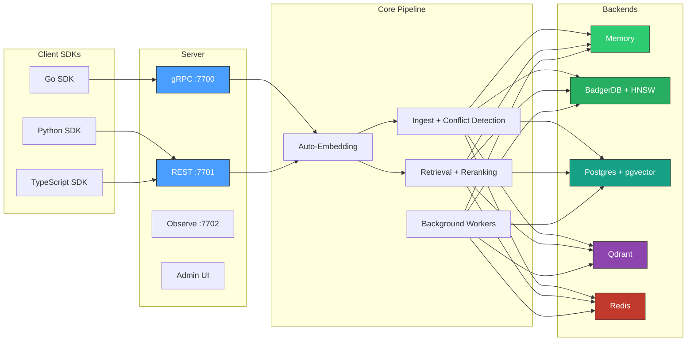

# contextdb
**[Documentation](docs/) | [Architecture](docs/architecture/) | [API](docs/api/) | [Quick Start](docs/quick-start.md)**

**The epistemics layer for AI systems — memory that knows what it knows, what it doesn't, and why it believes what it does.**

Most vector databases treat embeddings as the whole story. But AI systems that interact with the real world need facts that expire, sources that lie, memory that decays, and context that matters. contextdb handles all four.

[**Documentation**](https://antiartificial.github.io/contextdb) | [**Quick Start**](https://antiartificial.github.io/contextdb/quick-start) | [**API Reference**](https://antiartificial.github.io/contextdb/api/go-sdk) | [**Python SDK**](https://antiartificial.github.io/contextdb/api/python-sdk) | [**TypeScript SDK**](https://antiartificial.github.io/contextdb/api/typescript-sdk)


## What & Why

**Problem**: AI apps forget context across sessions. Each chat starts fresh. RAG is static. Knowledge graphs don't track trust.

**Solution**: ContextDB is a temporal graph-vector database that remembers, evolves, and validates AI memory.

**30-second demo**:
```bash
# Store a fact with source credibility
curl -X POST http://localhost:8080/v1/sources \
  -d '{"name": "standup_notes", "alpha": 8, "beta": 2}'

# Search with semantic + credibility ranking
curl "http://localhost:8080/v1/search?q=project+status"
```

**Why you need it**:
| Without ContextDB | With ContextDB |
|-------------------|----------------|
| "I don't know" | "Based on yesterday's standup (high credibility)..." |
| Static RAG dumps | Temporal versioning - facts evolve |
| All sources equal | Bayesian credibility propagation |
| "I can't explain my reasoning" | Narrative retrieval with evidence chains and citations |
| Uncalibrated confidence | Platt scaling: 0.7 confidence means 70% true |
| Forget-nothing or forget-everything | GDPR erasure, interference protection, cascade retraction |

See [docs/concepts/credibility.md](docs/concepts/credibility.md) and [docs/concepts/sm2.md](docs/concepts/sm2.md).
## Architecture



## Five lines to a working database

**Go:**
```go
db := client.MustOpen(client.Options{})
defer db.Close()

ns := db.Namespace("my-app", namespace.ModeGeneral)
res, _ := ns.Write(ctx, client.WriteRequest{
    Content:  "Go 1.22 added routing patterns to net/http",
    SourceID: "docs-crawler",  // tracks credibility of this source over time
    Vector:   embedding,       // or omit — auto-embedded when an Embedder is configured
})
results, _ := ns.Retrieve(ctx, client.RetrieveRequest{
    Vector: queryVec,
    TopK:   5, // return the 5 highest-scoring results (default: 10)
    // TopK controls the result set size. Lower values (1–5) are faster and
    // more focused — good for single-answer lookups. Higher values (20–50)
    // give the retrieval pipeline more candidates to score, rerank, and
    // diversify — better for RAG contexts where you need broad coverage.
})
```

**Python:**
```python
from contextdb import ContextDB

db = ContextDB("http://localhost:7701")
ns = db.namespace("my-app", mode="general")
ns.write(content="Go 1.22 added routing patterns", source_id="docs-crawler")
results = ns.retrieve(text="What changed in Go 1.22?", top_k=5)
```

**TypeScript:**
```typescript
import { ContextDB } from "contextdb";

const db = new ContextDB("http://localhost:7701");
const ns = db.namespace("my-app", "general");
await ns.write({ content: "Go 1.22 added routing patterns", sourceId: "docs-crawler" });
const results = await ns.retrieve({ text: "What changed in Go 1.22?", topK: 5 });
```

Zero external dependencies for embedded mode. One `go get` and you're running.

## What makes it different

### Data model

**[Bi-temporal storage](docs/concepts/temporal.md)** -- Every node tracks `valid_time` (when the fact was true in the world) and `transaction_time` (when the system learned it). Query what the database knew on any date. *Typical vector DBs: single timestamp or none.*

```go
// What did we know about rate limits on June 1st?
results, _ := ns.Retrieve(ctx, client.RetrieveRequest{
    Text: "API rate limit", TopK: 1, AsOf: time.Date(2024, 6, 1, 0, 0, 0, 0, time.UTC),
})
```

**[Source credibility](docs/concepts/credibility.md)** -- Sources have Bayesian credibility (Beta distribution). The admission gate rejects low-credibility writes before they enter the graph. *Typical vector DBs: trust everything equally.*

```go
// Moderator writes are always admitted at full confidence
ns.LabelSource(ctx, "moderator:alice", []string{"moderator"})

// Flag a troll -- all future writes rejected at the gate
ns.LabelSource(ctx, "user:spammer", []string{"troll"})
```

**[Conflict detection](docs/concepts/conflict-detection.md)** -- Contradictions are identified at write time via semantic similarity + label overlap, then tracked as `contradicts` edges in the graph. [Example](docs/examples.md#belief-reconciliation-when-agents-disagree). *Typical vector DBs: no contradiction awareness.*

**[Credibility learning](docs/concepts/credibility.md)** -- Sources that produce validated claims gain trust; those that contradict reliable facts lose it. Updates are Bayesian -- uncertainty decreases with more observations. [Example](docs/examples.md#belief-system-channel-fact-tracker). *Typical vector DBs: static trust scores.*

**[Memory decay](docs/concepts/memory-types.md)** -- Different knowledge decays at different rates. Episodic memories (half-life ~9h) fade quickly; procedural skills (half-life ~29d) persist. Background workers consolidate episodic memories into durable semantic knowledge. [Example](docs/examples.md#agent-memory-task-aware-retrieval). *Typical vector DBs: no decay model.*

### Retrieval

**[Hybrid retrieval](docs/architecture/read-path.md)** -- Fan out to vector ANN, graph walk, and session context simultaneously, then fuse with configurable weights. MMR diversity prevents near-duplicate results. [Example](docs/examples.md#rag-pipeline-document-retrieval). *Typical vector DBs: vector-only.*

**[Reranking](docs/architecture/read-path.md)** -- Optional LLM cross-encoder reranking after fusion. Falls back gracefully on LLM failure. *Typical vector DBs: no reranking.*

**[Caller-supplied weights](docs/concepts/scoring.md)** -- Every query can tune the balance between similarity, confidence, recency, and utility. Or use namespace mode defaults. *Typical vector DBs: fixed ranking.*

```go
// Boost recency for a news-focused query
results, _ := ns.Retrieve(ctx, client.RetrieveRequest{
    Text: "latest updates", TopK: 10,
    ScoreParams: core.ScoreParams{SimilarityWeight: 0.3, RecencyWeight: 0.5, ConfidenceWeight: 0.1, UtilityWeight: 0.1},
})
```

**[Query DSL](docs/api/dsl.md)** -- Two syntax tiers. Pipe syntax for the REPL (`search "x" | where confidence > 0.7 | top 5`). CQL for apps (`FIND "x" WHERE ... WEIGHT ... LIMIT 5`). Both compile to the same AST. [Example](docs/examples.md#query-dsl-pipe-syntax-and-cql). *Typical vector DBs: API-only.*

**[Label filtering](docs/api/go-sdk.md)** -- Restrict retrieval to nodes carrying specific labels. Push-down to backend when supported. *Typical vector DBs: no label support.*

### Trust & epistemics

**[Belief reconciliation](docs/examples.md#belief-reconciliation-when-agents-disagree)** -- When agents disagree, get a structured diff: which claims conflict, the evidence chain for each side, the credibility gap. "Git diff for beliefs." *Typical vector DBs: no belief tracking.*

```go
diff, _ := retrieval.ComputeBeliefDiff(ctx, graph, "ops", nil)
// diff.Conflicts[0].ClaimA: "Deploy uses blue-green" (conf: 0.9, 3 supporters)
// diff.Conflicts[0].ClaimB: "Deploy uses canary" (conf: 0.7, 1 supporter)
```

**[Narrative retrieval](docs/examples.md#narrative-retrieval-explain-what-you-know)** -- "Walk me through what you know about X and why." Returns a structured report with citations, evidence chains, contradictions, and a confidence explanation. [Example](docs/examples.md#narrative-retrieval-explain-what-you-know). *Typical vector DBs: ranked list of chunks.*

**[Calibration pipeline](docs/examples.md#calibration-turning-confidence-into-probability)** -- Measure how well confidence predicts truth (Brier score, ECE). Correct it with Platt scaling or isotonic regression. A claim with 0.7 confidence should be true ~70% of the time. [Example](docs/examples.md#calibration-turning-confidence-into-probability). *Typical vector DBs: uncalibrated scores.*

**[Interference detection](docs/examples.md#interference-detection-protecting-established-knowledge)** -- A low-credibility source can't erode a well-established, well-cited claim. The contradiction is tracked, but the original claim's confidence is protected. [Example](docs/examples.md#interference-detection-protecting-established-knowledge). *Typical vector DBs: last-write-wins.*

**[Knowledge gap detection](docs/examples.md#knowledge-gaps-what-dont-i-know)** -- "What don't I know about X?" Detects sparse regions in the semantic space and suggests what information to acquire next. [Example](docs/examples.md#knowledge-gaps-what-dont-i-know). *Typical vector DBs: no gap awareness.*

### Operations

**[Retraction](docs/examples.md#cascade-retraction-when-a-source-claim-is-wrong)** -- Non-destructive "I take this back" that cascades through `derives_from` edges. The audit trail is preserved -- retraction markers, not deletion. [Example](docs/examples.md#cascade-retraction-when-a-source-claim-is-wrong). *Typical vector DBs: hard delete or nothing.*

**[GDPR erasure](docs/examples.md#gdpr-erasure-audit-trailed-right-to-be-forgotten)** -- Audit-trailed right-to-erasure across graph, vectors, KV cache, and event log. Retracts nodes, deletes embeddings, invalidates edges, preserves the audit shape. [Example](docs/examples.md#gdpr-erasure-audit-trailed-right-to-be-forgotten). *Typical vector DBs: manual deletion.*

**[Claim federation](docs/examples.md#federation-multi-instance-shared-memory)** -- Gossip-based multi-instance replication using hashicorp/memberlist. Source credibility merges additively in Beta space -- two instances observing the same source is more evidence, not a conflict. [Example](docs/examples.md#federation-multi-instance-shared-memory). *Typical vector DBs: single instance only.*

**[Namespace modes](docs/concepts/namespaces.md)** -- `belief_system`, `agent_memory`, `general`, `procedural`. Each ships tuned defaults for scoring weights, decay rates, and compaction. Switch with one parameter. *Typical vector DBs: one-size-fits-all.*

**[Auto-embedding](docs/architecture/embedding.md)** -- Text automatically embedded via OpenAI, local, or custom providers with LRU cache. Send text, get vectors — or bring your own. *Typical vector DBs: bring your own vectors.*

**[Active recall](docs/concepts/sm2.md)** -- SM-2 spaced repetition boosts utility for memories that are successfully recalled. Background worker handles scheduling. [Example](docs/concepts/sm2.md#example). *Typical vector DBs: no recall model.*

**[Memory consolidation](docs/architecture/background-workers.md)** -- RAPTOR compaction clusters similar nodes and summarizes them. Episodic memories promote to durable semantic knowledge. *Typical vector DBs: no consolidation.*

**[RBAC](docs/concepts/rbac.md)** -- Token-based `tenant:permissions:secret` controlling read/write/admin per namespace. *Typical vector DBs: no access control.*

**[Snapshot/restore](docs/api/go-sdk.md#export--import)** -- NDJSON export and import per namespace, including full version history. *Typical vector DBs: no portability.*

**[Admin UI](docs/deployment/scaled.md)** -- Built-in dashboard on the observe port with stats, metrics links, and [time-travel queries](docs/examples.md#time-travel-admin-api). *Typical vector DBs: external tooling.*

## Scoring function

```
score = w_sim * cosine(candidate, query) + w_conf * confidence + w_rec * exp(-alpha * age) + w_util * utility
```

All weights normalised at query time. Different namespace modes ship tuned defaults.

## Deployment modes

| Mode | Backend | Use case |
|:-----|:--------|:---------|
| **Embedded** | In-memory or BadgerDB | Dev, testing, sidecars, CLIs |
| **Standard** | Postgres + pgvector | Production single-node |
| **Remote** | gRPC to contextdb server | Microservices, multi-language clients |
| **Scaled** | Qdrant + Redis + Postgres | High-throughput production |

## Quick start

```bash
go get github.com/antiartificial/contextdb@latest
```

```bash
# Run the server (no external dependencies)
make run

# With Postgres
docker compose up --build

# Scaled mode (Qdrant + Redis + Postgres)
docker compose --profile scaled up --build

# Run all tests
make test

# Coverage
make cover-text

# Benchmarks
make bench-mteb          # MTEB retrieval quality
make bench-adversarial   # Poisoning resistance, temporal consistency
make bench               # Full benchmark suite with HTML report
```

## Project layout

```
contextdb/
├── cmd/contextdb/           # server entrypoint (gRPC + REST + observe)
├── internal/
│   ├── core/                # Node, Edge, Source, ScoreParams
│   ├── store/               # GraphStore, VectorIndex, KVStore, EventLog
│   │   ├── memory/          # in-process backend
│   │   ├── badger/          # BadgerDB + HNSW backend
│   │   ├── postgres/        # Postgres + pgvector backend
│   │   ├── qdrant/          # Qdrant vector backend (scaled mode)
│   │   ├── redis/           # Redis KV + EventLog backend (scaled mode)
│   │   └── remote/          # gRPC remote store client
│   ├── embedding/           # auto-embedding (OpenAI, local, cached)
│   ├── extract/             # LLM entity/relation extraction
│   ├── ingest/              # admission gate, conflict detection, credibility learning
│   ├── compact/             # RAPTOR compaction, memory consolidation, active recall
│   ├── dsl/                 # query languages (pipe syntax + CQL)
│   ├── retrieval/           # hybrid retrieval, scoring, reranking
│   ├── server/              # gRPC + REST + RBAC + auth
│   ├── admin/               # admin dashboard UI
│   ├── snapshot/            # NDJSON export/import
│   ├── namespace/           # mode presets
│   ├── federation/          # gossip-based claim federation
│   └── observe/             # metrics, pprof, health
├── pkg/client/              # Go SDK
├── sdk/
│   ├── python/              # Python SDK (pip install contextdb)
│   └── typescript/          # TypeScript SDK (npm install contextdb)
├── bench/
│   ├── longmemeval/         # LongMemEval benchmark
│   ├── mteb/                # MTEB retrieval quality
│   └── adversarial/         # adversarial resistance
├── deploy/helm/contextdb/   # Helm chart
└── docs/                    # Documentation (GitHub Pages)
```

## Related work

- [Zep / Graphiti](https://arxiv.org/abs/2501.13956) -- bi-temporal KG for agent memory
- [Hindsight](https://arxiv.org/abs/2512.12818) -- TEMPR multi-strategy retrieval
- [RAPTOR](https://arxiv.org/abs/2401.18059) -- hierarchical summarisation for compaction
- [A-MAC](https://arxiv.org/abs/2603.04549) -- adaptive memory admission control

## License

MIT
