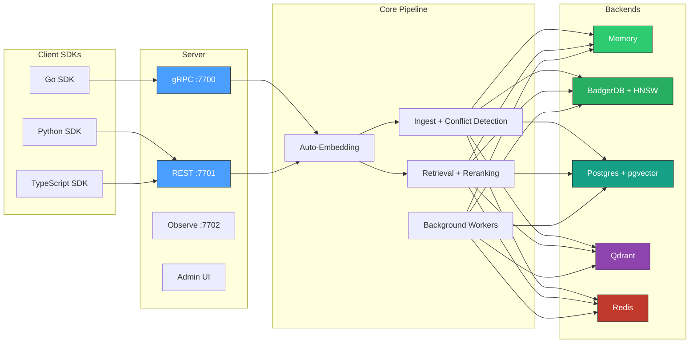

# contextdb
**[Documentation](docs/) | [Architecture](docs/architecture/) | [API](docs/api/) | [Quick Start](docs/quick-start.md)**

**The epistemics layer for AI systems — memory that knows what it knows, what it doesn't, and why it believes what it does.**

Most vector databases treat embeddings as the whole story. But AI systems that interact with the real world need facts that expire, sources that lie, memory that decays, and context that matters. contextdb handles all four.

[**Documentation**](https://antiartificial.github.io/contextdb) | [**Quick Start**](https://antiartificial.github.io/contextdb/quick-start) | [**API Reference**](https://antiartificial.github.io/contextdb/api/go-sdk) | [**Python SDK**](https://antiartificial.github.io/contextdb/api/python-sdk) | [**TypeScript SDK**](https://antiartificial.github.io/contextdb/api/typescript-sdk)


## What & Why

**Problem**: AI apps forget context across sessions. Each chat starts fresh. RAG is static. Knowledge graphs don't track trust.

**Solution**: ContextDB is a temporal graph-vector database that remembers, evolves, and validates AI memory.

**30-second demo**:
```bash
# Store a fact with source credibility
curl -X POST http://localhost:8080/v1/sources \
  -d '{"name": "standup_notes", "alpha": 8, "beta": 2}'

# Search with semantic + credibility ranking
curl "http://localhost:8080/v1/search?q=project+status"
```

**Why you need it**:
| Without ContextDB | With ContextDB |
|-------------------|----------------|
| "I don't know" | "Based on yesterday's standup (high credibility)..." |
| Static RAG dumps | Temporal versioning - facts evolve |
| All sources equal | Bayesian credibility propagation |
| "I can't explain my reasoning" | Narrative retrieval with evidence chains and citations |
| Uncalibrated confidence | Platt scaling: 0.7 confidence means 70% true |
| Forget-nothing or forget-everything | GDPR erasure, interference protection, cascade retraction |

See [docs/concepts/credibility.md](docs/concepts/credibility.md) and [docs/concepts/sm2.md](docs/concepts/sm2.md).
## Architecture



## Five lines to a working database

**Go:**
```go
db := client.MustOpen(client.Options{})
defer db.Close()

ns := db.Namespace("my-app", namespace.ModeGeneral)
res, _ := ns.Write(ctx, client.WriteRequest{
    Content: "Go 1.22 added routing patterns to net/http",
    SourceID: "docs-crawler",
    Vector:   embedding,
})
results, _ := ns.Retrieve(ctx, client.RetrieveRequest{Vector: queryVec, TopK: 5})
```

**Python:**
```python
from contextdb import ContextDB

db = ContextDB("http://localhost:7701")
ns = db.namespace("my-app", mode="general")
ns.write(content="Go 1.22 added routing patterns", source_id="docs-crawler")
results = ns.retrieve(text="What changed in Go 1.22?", top_k=5)
```

**TypeScript:**
```typescript
import { ContextDB } from "contextdb";

const db = new ContextDB("http://localhost:7701");
const ns = db.namespace("my-app", "general");
await ns.write({ content: "Go 1.22 added routing patterns", sourceId: "docs-crawler" });
const results = await ns.retrieve({ text: "What changed in Go 1.22?", topK: 5 });
```

Zero external dependencies for embedded mode. One `go get` and you're running.

## What makes it different

| Feature | contextdb | Typical vector DB |
|:--------|:----------|:------------------|
| **Bi-temporal storage** | `valid_time` + `transaction_time` tracked independently | Single timestamp or none |
| **Source credibility** | Admission gate rejects trolls and spam at write time | Trust everything equally |
| **Conflict detection** | Contradictions identified and tracked as graph edges | No contradiction awareness |
| **Credibility learning** | Bayesian updates adjust source trust over time | Static trust scores |
| **Auto-embedding** | Text automatically embedded via OpenAI, local, or custom providers | Bring your own vectors |
| **Memory decay** | Exponential decay with configurable half-lives per memory type | No decay model |
| **Hybrid retrieval** | Vector + graph + session fan-out with unified scoring | Vector-only |
| **Reranking** | Optional LLM cross-encoder reranking after fusion | No reranking |
| **Label filtering** | Filter retrieval results by node labels | No label support |
| **Memory consolidation** | Episodic → semantic promotion via LLM | No consolidation |
| **Active recall** | Spaced-repetition utility boosting | No recall model |
| **Caller-supplied weights** | Similarity, confidence, recency, utility -- per query | Fixed ranking |
| **Query DSL** | Pipe syntax (REPL) and CQL (apps) with temporal, graph, and weight clauses | API-only |
| **Namespace modes** | belief_system, agent_memory, general, procedural | One-size-fits-all |
| **RBAC** | Token-based read/write/admin permissions per tenant | No access control |
| **Snapshot/restore** | NDJSON export and import per namespace | No portability |
| **Admin UI** | Built-in dashboard on observe port | External tooling |
| **Belief reconciliation** | "git diff" for beliefs — structured disagreements with evidence chains | No belief tracking |
| **Narrative retrieval** | "Walk me through what you know about X and why" with citations | Ranked list of chunks |
| **Knowledge gap detection** | "What don't I know?" — sparse region detection with acquisition suggestions | No gap awareness |
| **Calibration pipeline** | Brier score, ECE, Platt scaling — confidence becomes calibrated probability | Uncalibrated scores |
| **GDPR erasure** | Audit-trailed right-to-erasure across all storage layers | Manual deletion |
| **Interference detection** | Low-credibility sources can't overwrite well-established claims | Last-write-wins |
| **Claim federation** | Gossip-based multi-instance replication with Beta-space credibility merge | Single instance only |
| **Retraction** | Non-destructive "I take this back" with cascade through derived claims | Hard delete or nothing |

## Scoring function

```
score = w_sim * cosine(candidate, query) + w_conf * confidence + w_rec * exp(-alpha * age) + w_util * utility
```

All weights normalised at query time. Different namespace modes ship tuned defaults.

## Deployment modes

| Mode | Backend | Use case |
|:-----|:--------|:---------|
| **Embedded** | In-memory or BadgerDB | Dev, testing, sidecars, CLIs |
| **Standard** | Postgres + pgvector | Production single-node |
| **Remote** | gRPC to contextdb server | Microservices, multi-language clients |
| **Scaled** | Qdrant + Redis + Postgres | High-throughput production |

## Quick start

```bash
go get github.com/antiartificial/contextdb@latest
```

```bash
# Run the server (no external dependencies)
make run

# With Postgres
docker compose up --build

# Scaled mode (Qdrant + Redis + Postgres)
docker compose --profile scaled up --build

# Run all tests
make test

# Coverage
make cover-text

# Benchmarks
make bench-mteb          # MTEB retrieval quality
make bench-adversarial   # Poisoning resistance, temporal consistency
make bench               # Full benchmark suite with HTML report
```

## Project layout

```
contextdb/
├── cmd/contextdb/           # server entrypoint (gRPC + REST + observe)
├── internal/
│   ├── core/                # Node, Edge, Source, ScoreParams
│   ├── store/               # GraphStore, VectorIndex, KVStore, EventLog
│   │   ├── memory/          # in-process backend
│   │   ├── badger/          # BadgerDB + HNSW backend
│   │   ├── postgres/        # Postgres + pgvector backend
│   │   ├── qdrant/          # Qdrant vector backend (scaled mode)
│   │   ├── redis/           # Redis KV + EventLog backend (scaled mode)
│   │   └── remote/          # gRPC remote store client
│   ├── embedding/           # auto-embedding (OpenAI, local, cached)
│   ├── extract/             # LLM entity/relation extraction
│   ├── ingest/              # admission gate, conflict detection, credibility learning
│   ├── compact/             # RAPTOR compaction, memory consolidation, active recall
│   ├── dsl/                 # query languages (pipe syntax + CQL)
│   ├── retrieval/           # hybrid retrieval, scoring, reranking
│   ├── server/              # gRPC + REST + RBAC + auth
│   ├── admin/               # admin dashboard UI
│   ├── snapshot/            # NDJSON export/import
│   ├── namespace/           # mode presets
│   ├── federation/          # gossip-based claim federation
│   └── observe/             # metrics, pprof, health
├── pkg/client/              # Go SDK
├── sdk/
│   ├── python/              # Python SDK (pip install contextdb)
│   └── typescript/          # TypeScript SDK (npm install contextdb)
├── bench/
│   ├── longmemeval/         # LongMemEval benchmark
│   ├── mteb/                # MTEB retrieval quality
│   └── adversarial/         # adversarial resistance
├── deploy/helm/contextdb/   # Helm chart
└── docs/                    # Documentation (GitHub Pages)
```

## Related work

- [Zep / Graphiti](https://arxiv.org/abs/2501.13956) -- bi-temporal KG for agent memory
- [Hindsight](https://arxiv.org/abs/2512.12818) -- TEMPR multi-strategy retrieval
- [RAPTOR](https://arxiv.org/abs/2401.18059) -- hierarchical summarisation for compaction
- [A-MAC](https://arxiv.org/abs/2603.04549) -- adaptive memory admission control

## License

MIT
