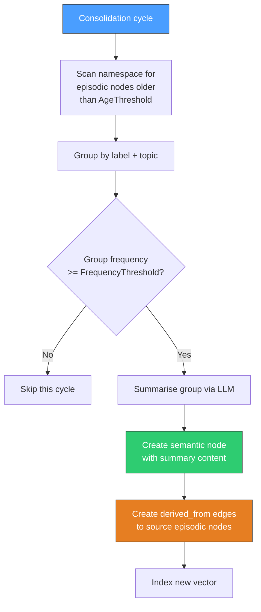
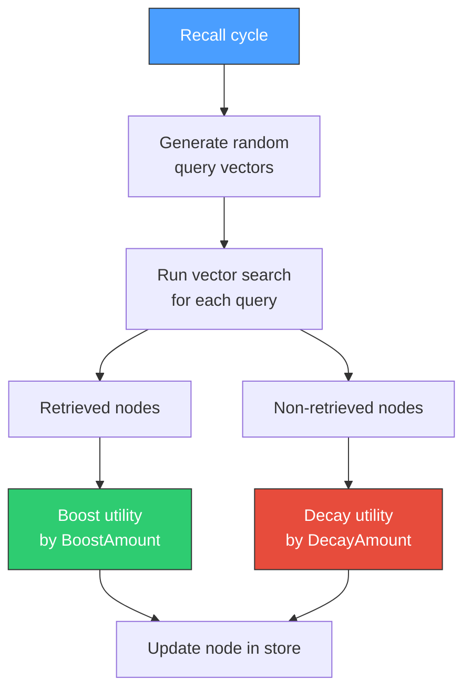

# Background Workers

contextdb runs two optional background workers that improve memory quality over time: **memory consolidation** and **active recall**. Both are lifecycle-managed with `Start(ctx)` and `Stop()` methods.

## Memory consolidation

The consolidator converts ephemeral episodic memories into durable semantic knowledge, inspired by how biological memory systems work during sleep.

### How it works



### Configuration

```go
cfg := compact.ConsolidationConfig{
    AgeThreshold:       24 * time.Hour,  // min age for episodic nodes
    FrequencyThreshold: 3,                // min group size for promotion
    Interval:           30 * time.Minute, // polling interval
    Namespaces:         []string{"my-app"},
}

consolidator := compact.NewConsolidator(graph, vecs, eventLog, llmProvider, cfg, logger)
consolidator.Start(ctx)
defer consolidator.Stop()
```

| Field | Type | Default | Description |
|:------|:-----|:--------|:------------|
| `AgeThreshold` | `time.Duration` | `24h` | Minimum age before episodic nodes are eligible |
| `FrequencyThreshold` | `int` | `3` | Minimum group size to trigger consolidation |
| `Interval` | `time.Duration` | `30m` | How often the consolidator runs |
| `Namespaces` | `[]string` | `[]` | Which namespaces to process (must be explicit) |

### LLM fallback

Without an LLM provider, the consolidator falls back to concatenating the episodic node contents. With an LLM, it produces a coherent summary that distills the key information.

### Derived-from edges

Each semantic node links back to its source episodic nodes via `derived_from` edges. This preserves provenance -- you can always trace a consolidated memory back to the original observations.

---

## Active recall

The recall worker implements a spaced-repetition-inspired mechanism. It periodically probes the vector index with random queries and adjusts node utility scores based on whether they are retrieved.

### How it works



### Configuration

```go
cfg := compact.RecallConfig{
    Interval:        1 * time.Hour,
    QueriesPerCycle: 10,
    BoostAmount:     0.05,
    DecayAmount:     0.01,
    Namespaces:      []string{"my-app"},
}

worker := compact.NewRecallWorker(graph, vecs, cfg, logger)
worker.Start(ctx)
defer worker.Stop()
```

| Field | Type | Default | Description |
|:------|:-----|:--------|:------------|
| `Interval` | `time.Duration` | `1h` | How often the recall cycle runs |
| `QueriesPerCycle` | `int` | `10` | Number of random probes per cycle |
| `BoostAmount` | `float64` | `0.05` | Utility increase for retrieved nodes |
| `DecayAmount` | `float64` | `0.01` | Utility decrease for unretrieved nodes |
| `Namespaces` | `[]string` | `[]` | Which namespaces to process |

### Effect on retrieval

The utility score feeds into the composite scoring function:

```
score = w_sim * similarity + w_conf * confidence + w_rec * recency + w_util * utility
```

Nodes that are consistently retrievable (relevant to diverse queries) accumulate higher utility and rank higher in results. Nodes that are never retrieved gradually decay, making room for more useful information.

---

## Worker lifecycle

Both workers follow the same pattern:

```go
worker.Start(ctx)  // launches background goroutine
// ... application runs ...
worker.Stop()      // signals shutdown and waits for completion
```

Workers respect context cancellation. When the parent context is cancelled, workers finish their current cycle and exit cleanly.
