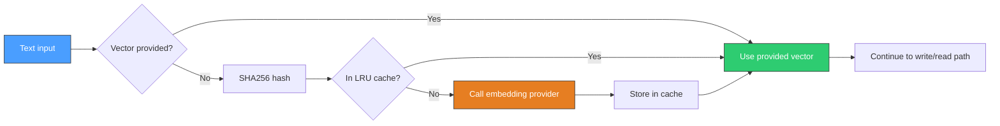

# Auto-Embedding Pipeline

contextdb can automatically embed text into vectors, removing the need for callers to manage their own embedding pipeline. When configured, text provided in `WriteRequest.Content` or `RetrieveRequest.Text` is passed through the embedding pipeline before entering the write or read path.

## Flow



## Embedder interface

All embedding providers implement a simple interface:

```go
type Embedder interface {
    Embed(ctx context.Context, texts []string) ([][]float32, error)
    Dimensions() int
}
```

`Embed` accepts a batch of texts and returns one vector per text. `Dimensions` returns the embedding dimensionality (e.g. 1536 for OpenAI `text-embedding-3-small`).

## Providers

### OpenAI

Works with OpenAI, Azure OpenAI, Ollama, vLLM, and any OpenAI-compatible API.

```go
emb := embedding.NewOpenAI(
    "https://api.openai.com/v1",  // base URL
    os.Getenv("OPENAI_API_KEY"),  // API key
    "text-embedding-3-small",     // model
    1536,                         // dimensions
)

db := client.MustOpen(client.Options{
    Embedder:   emb,
    EmbedModel: "text-embedding-3-small",
})
```

Options:
- `embedding.WithHTTPClient(c)` -- use a custom `*http.Client` for proxies or timeouts

### Local

Calls a local HTTP sidecar that implements a simple embedding API.

```go
emb := embedding.NewLocal("http://localhost:8080", 384)
```

The sidecar must accept `POST /embed` with body `{"texts": ["..."]}` and return `{"embeddings": [[...]]}`.

## Caching

The `Cached` wrapper adds an LRU cache in front of any provider:

```go
emb := embedding.NewCached(
    embedding.NewOpenAI(...),
    4096,  // max items in cache
)
```

Cache keys are SHA256 hashes of the input text. The cache is thread-safe and avoids re-embedding identical text across writes and retrievals.

## Configuration

| Option | Type | Default | Description |
|:-------|:-----|:--------|:------------|
| `Options.Embedder` | `embedding.Embedder` | `nil` | Embedding provider |
| `Options.EmbedModel` | `string` | `""` | Model identifier stored as provenance on nodes |
| `Options.VectorDimensions` | `int` | `1536` | Embedding dimensionality |

When `Embedder` is configured:
- **Writes** without a `Vector` field will have the `Content` auto-embedded
- **Retrievals** with a `Text` field (instead of `Vector`) will have the query auto-embedded
- The `EmbedModel` is recorded in node metadata for provenance tracking

When `Embedder` is `nil`, callers must provide pre-computed vectors. Writes without vectors still work but skip vector indexing.
