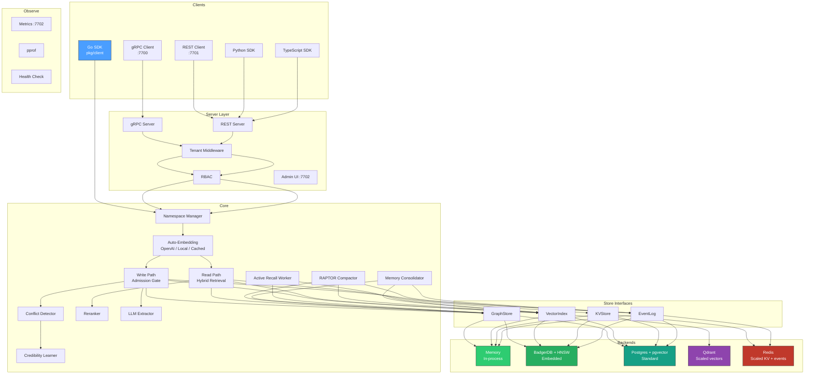

# System Overview

contextdb is a layered system with pluggable storage backends, an auto-embedding pipeline, conflict detection, background workers, and parallel retrieval paths.

## Component diagram



## Layer responsibilities

### Client layer (`pkg/client`)
- `DB`: connection handle, analogous to `sql.DB`
- `NamespaceHandle`: scoped read/write operations
- Four modes: embedded (in-process), standard (Postgres), remote (gRPC), scaled (Qdrant + Redis)

### Server layer (`internal/server`)
- gRPC server on `:7700` with JSON codec (no protobuf codegen required)
- REST server on `:7701` with Go 1.22+ routing patterns
- Multi-tenant isolation via `X-Tenant-ID` header or Bearer token prefix
- RBAC middleware with `tenant:permissions:secret` token format
- Observe server on `:7702` with Prometheus metrics, pprof, health check, and admin UI

### Embedding (`internal/embedding`)
- Auto-embeds text when `Options.Embedder` is configured
- Providers: OpenAI-compatible, local HTTP sidecar
- LRU cache with SHA256 text hashing avoids redundant API calls

### Write path (`internal/ingest`)
- Source resolution and credibility lookup
- Admission gate: credibility floor, near-duplicate detection, novelty threshold
- Conflict detection: identifies contradictions, creates `contradicts` edges
- Credibility learning: Bayesian updates adjust source trust over time
- Graph upsert + vector indexing + event logging

### Read path (`internal/retrieval`)
- Concurrent fan-out: vector search + graph traversal + session context
- Fusion: deduplicate and merge results from all paths
- Scoring: composite score with caller-supplied weights
- Reranking: optional LLM cross-encoder reranking after fusion
- Label filtering: push-down filter on node labels

### Background workers (`internal/compact`)
- **RAPTOR compaction**: hierarchical summarisation
- **Memory consolidation**: episodic → semantic promotion via LLM
- **Active recall**: spaced-repetition utility boosting

### Snapshot/restore (`internal/snapshot`)
- NDJSON export and import per namespace
- Supports full namespace dump or seed-based BFS subgraph export

### Store interfaces (`internal/store`)
- `GraphStore`: node/edge CRUD, versioning, walk
- `VectorIndex`: ANN search, index, delete
- `KVStore`: key-value with TTL (caching, sessions)
- `EventLog`: append-only temporal event stream

### Backends
- **Memory**: in-process maps and slices, zero dependencies
- **BadgerDB + HNSW**: embedded persistent storage, single binary
- **Postgres + pgvector**: production-grade with recursive CTE graph traversal
- **Qdrant**: dedicated vector index for scaled mode
- **Redis**: KV store and event log for scaled mode

## Project layout

```
contextdb/
├── cmd/contextdb/           # server entrypoint
├── internal/
│   ├── core/                # domain types: Node, Edge, Source, ScoreParams
│   ├── store/               # store interfaces
│   │   ├── memory/          # in-process backend
│   │   ├── badger/          # BadgerDB + HNSW backend
│   │   ├── postgres/        # Postgres + pgvector backend
│   │   ├── qdrant/          # Qdrant vector backend
│   │   ├── redis/           # Redis KV + EventLog backend
│   │   └── remote/          # gRPC remote store client
│   ├── embedding/           # auto-embedding pipeline
│   ├── extract/             # LLM entity/relation extraction
│   ├── ingest/              # write path: admission, conflict detection, credibility
│   ├── compact/             # RAPTOR compaction, consolidation, active recall
│   ├── retrieval/           # read path: fusion, scoring, reranking
│   ├── server/              # gRPC + REST + RBAC + auth
│   ├── admin/               # admin dashboard UI
│   ├── snapshot/            # NDJSON export/import
│   ├── namespace/           # mode presets and config
│   └── observe/             # metrics, pprof, health
├── pkg/client/              # Go SDK
├── sdk/
│   ├── python/              # Python SDK
│   └── typescript/          # TypeScript SDK
├── bench/                   # benchmarks and evaluation
│   ├── longmemeval/         # LongMemEval benchmark harness
│   ├── mteb/                # MTEB retrieval quality
│   └── adversarial/         # poisoning and temporal consistency
└── deploy/helm/contextdb/   # Helm chart for Kubernetes
```
