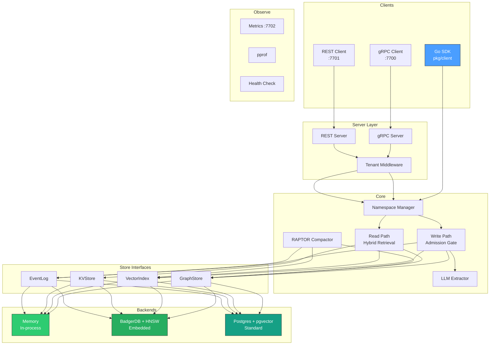

# System Overview

contextdb is a layered system with pluggable storage backends and parallel retrieval paths.

## Component diagram



## Layer responsibilities

### Client layer (`pkg/client`)
- `DB` -- connection handle, analogous to `sql.DB`
- `NamespaceHandle` -- scoped read/write operations
- Three modes: embedded (in-process), standard (Postgres), remote (gRPC)

### Server layer (`internal/server`)
- gRPC server on `:7700` with JSON codec (no protobuf codegen required)
- REST server on `:7701` with Go 1.22+ routing patterns
- Multi-tenant isolation via `X-Tenant-ID` header or Bearer token prefix
- Observe server on `:7702` with Prometheus metrics, pprof, and health check

### Write path (`internal/ingest`)
- Source resolution and credibility lookup
- Admission gate: credibility floor, near-duplicate detection, novelty threshold
- Graph upsert + vector indexing + event logging

### Read path (`internal/retrieval`)
- Concurrent fan-out: vector search + graph traversal + session context
- Fusion: deduplicate and merge results from all paths
- Scoring: composite score with caller-supplied weights

### Store interfaces (`internal/store`)
- `GraphStore` -- node/edge CRUD, versioning, walk
- `VectorIndex` -- ANN search, index, delete
- `KVStore` -- key-value with TTL (caching, sessions)
- `EventLog` -- append-only temporal event stream

### Backends
- **Memory** -- in-process maps and slices, zero dependencies
- **BadgerDB + HNSW** -- embedded persistent storage, single binary
- **Postgres + pgvector** -- production-grade with recursive CTE graph traversal

## Project layout

```
contextdb/
├── cmd/contextdb/           # server entrypoint
├── internal/
│   ├── core/                # domain types: Node, Edge, Source, ScoreParams
│   ├── store/               # store interfaces
│   │   ├── memory/          # in-process backend
│   │   ├── badger/          # BadgerDB + HNSW backend
│   │   └── postgres/        # Postgres + pgvector backend
│   ├── extract/             # LLM entity/relation extraction
│   ├── ingest/              # write path: admission gate
│   ├── compact/             # RAPTOR hierarchical compaction
│   ├── retrieval/           # read path: fusion, scoring
│   ├── server/              # gRPC + REST servers
│   ├── namespace/           # mode presets and config
│   └── observe/             # metrics, pprof, health
├── pkg/client/              # Go SDK
├── bench/                   # benchmarks and evaluation
│   └── longmemeval/         # LongMemEval benchmark harness
└── deploy/helm/contextdb/   # Helm chart for Kubernetes
```
