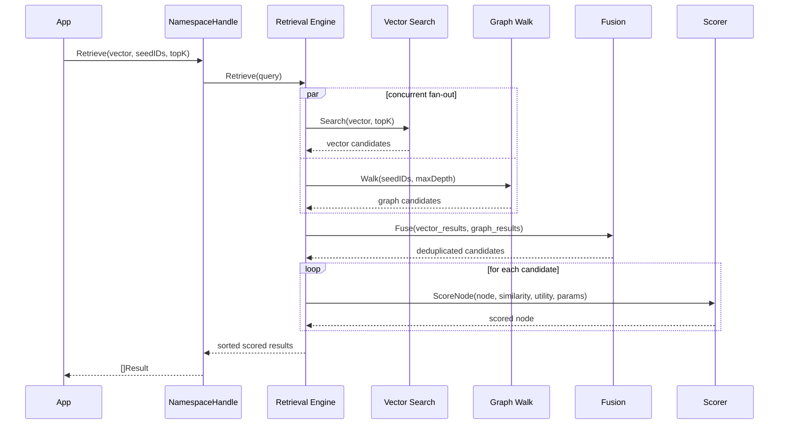

# Read Path

Retrieval uses concurrent fan-out across multiple search strategies, fuses the results, and scores them with a unified function.

## Sequence



## Search strategies

### Vector search
ANN (approximate nearest neighbour) search using the query embedding. Returns candidates ranked by cosine similarity.

- **Memory backend**: brute-force scan
- **BadgerDB backend**: HNSW index (M=16, efConstruction=200)
- **Postgres backend**: pgvector `<=>` operator with IVFFlat index

### Graph walk
Breadth-first traversal from seed nodes, following edges outward. Discovers contextually related nodes that may not be close in vector space.

Traversal strategies:

| Strategy | Behaviour |
|:---------|:----------|
| **BFS** | Standard breadth-first, all edges |
| **Beam** | Keep top-K candidates at each depth |
| **WaterCircle** | Expanding ring with edge weight decay |

### Session context
Recent nodes from the current session (via KVStore). Provides conversational continuity.

## Fusion

The fusion step merges results from all paths:

1. **Deduplicate** by node ID
2. **Tag** each result with its retrieval source ("vector", "graph", "fused")
3. Nodes found by multiple paths are tagged "fused"

## Scoring

Each candidate is scored by the composite function:

```
score = w_sim * similarity + w_conf * confidence + w_rec * recency + w_util * utility
```

See [Scoring Function](../concepts/scoring) for details on weights and decay.

## Hybrid strategy weights

The retrieval engine balances vector vs. graph results:

```go
strategy := retrieval.HybridStrategy{
    VectorWeight:  0.45,  // how much to trust vector results
    GraphWeight:   0.40,  // how much to trust graph results
    SessionWeight: 0.15,  // how much to trust session context
    Traversal:     store.StrategyWaterCircle,
    MaxDepth:      3,
}
```

These defaults come from the namespace mode and can be overridden per-query.

## Temporal filtering

All results are filtered by temporal validity:

- Nodes where `ValidFrom > AsOf` are excluded
- Nodes where `ValidUntil < AsOf` are excluded
- Nodes failing `IsValidAt(AsOf)` receive a score of 0

This means point-in-time queries automatically see only facts that were valid at the requested time.
