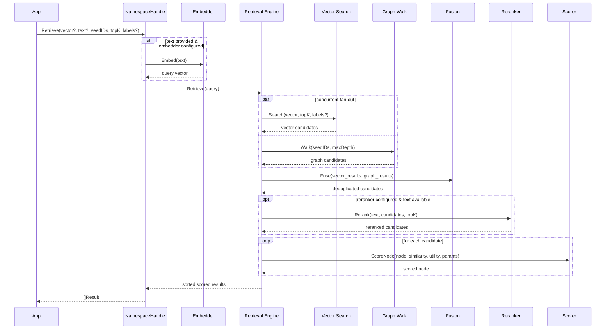

# Read Path

Retrieval uses concurrent fan-out across multiple search strategies, fuses the results, optionally reranks them, and scores with a unified function.

## Sequence



## Search strategies

### Vector search

ANN (approximate nearest neighbour) search using the query embedding. Returns candidates ranked by cosine similarity.

- **Memory backend**: brute-force scan
- **BadgerDB backend**: HNSW index (M=16, efConstruction=200)
- **Postgres backend**: pgvector `<=>` operator with IVFFlat index
- **Qdrant backend**: native ANN with label metadata filtering

When `Labels` are specified in the request, vector search applies label push-down filtering. Only nodes with all specified labels are returned.

### Graph walk

Breadth-first traversal from seed nodes, following edges outward. Discovers contextually related nodes that may not be close in vector space.

Traversal strategies:

| Strategy | Behaviour |
|:---------|:----------|
| **BFS** | Standard breadth-first, all edges |
| **Beam** | Keep top-K candidates at each depth |
| **WaterCircle** | Expanding ring with edge weight decay |

### Session context

Recent nodes from the current session (via KVStore). Provides conversational continuity.

## Auto-embedding for text queries

When a `RetrieveRequest` includes `Text` instead of (or in addition to) `Vector`, the text is automatically embedded using the configured `Embedder`. This enables natural-language queries without requiring callers to manage their own embedding pipeline.

```go
results, _ := ns.Retrieve(ctx, client.RetrieveRequest{
    Text: "What changed in Go 1.22?",
    TopK: 5,
})
```

## Fusion

The fusion step merges results from all paths:

1. **Deduplicate** by node ID
2. **Tag** each result with its retrieval source ("vector", "graph", "fused")
3. Nodes found by multiple paths are tagged "fused"

## Reranking

When an LLM reranker is configured and the query includes text, fusion results are passed through a cross-encoder-style reranker before scoring. The reranker uses the LLM to assess relevance of each candidate to the original query text, producing a more semantically accurate ordering.

```go
engine := retrieval.Engine{
    // ...
    Reranker: retrieval.NewLLMReranker(llmProvider, "gpt-4o-mini"),
}
```

If the reranker fails or is not configured, candidates proceed to scoring in their original fusion order.

## Label filtering

The `Labels` field in `RetrieveRequest` filters results to only include nodes that have **all** specified labels:

```go
results, _ := ns.Retrieve(ctx, client.RetrieveRequest{
    Vector: queryVec,
    Labels: []string{"Claim", "Verified"},
    TopK:   10,
})
```

Label filtering is pushed down to the vector search backend when supported (Qdrant, Postgres). For other backends, it is applied as a post-filter.

## Scoring

Each candidate is scored by the composite function:

```
score = w_sim * similarity + w_conf * confidence + w_rec * recency + w_util * utility
```

See [Scoring Function](../concepts/scoring) for details on weights and decay.

## Streaming (gRPC)

The gRPC API supports server-streamed retrieval via `StreamRetrieve`. Results are sent one at a time as they are scored, allowing clients to begin processing before the full result set is ready.

```
rpc StreamRetrieve(GRPCRetrieveRequest) returns (stream GRPCRetrieveResponse)
```

## Hybrid strategy weights

The retrieval engine balances vector vs. graph results:

```go
strategy := retrieval.HybridStrategy{
    VectorWeight:  0.45,  // how much to trust vector results
    GraphWeight:   0.40,  // how much to trust graph results
    SessionWeight: 0.15,  // how much to trust session context
    Traversal:     store.StrategyWaterCircle,
    MaxDepth:      3,
}
```

These defaults come from the namespace mode and can be overridden per-query.

## Temporal filtering

All results are filtered by temporal validity:

- Nodes where `ValidFrom > AsOf` are excluded
- Nodes where `ValidUntil < AsOf` are excluded
- Nodes failing `IsValidAt(AsOf)` receive a score of 0

This means point-in-time queries automatically see only facts that were valid at the requested time.
