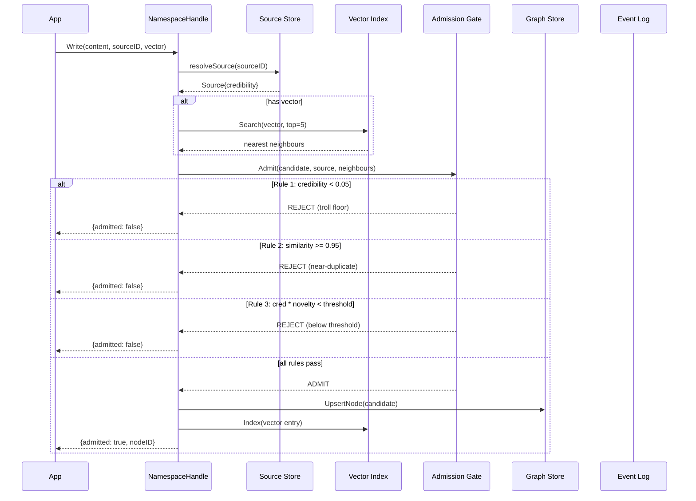
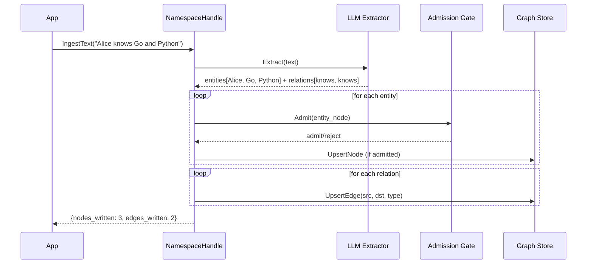

# Write Path

Every write passes through the admission gate before being persisted.

## Sequence



## Step by step

### 1. Source resolution
Look up the source by `ExternalID`. If it doesn't exist, create one with neutral credibility (0.5). Apply label overrides ("moderator" -> 1.0, "troll" -> 0.05).

### 2. Near-duplicate scan
If the write includes a vector, do a quick ANN search for the 5 nearest existing nodes. This is used by the admission gate to detect duplicates and compute novelty.

### 3. Admission gate
Three rules run in order:

| Rule | Condition | Result |
|:-----|:----------|:-------|
| Credibility floor | `effective_credibility <= 0.05` | Reject |
| Near-duplicate | `max(similarity) >= 0.95` | Reject |
| Novelty threshold | `credibility * (1 - max_similarity) < threshold` | Reject |

### 4. Persist
If admitted:
- **Graph store**: `UpsertNode` writes the node with full metadata
- **Vector index**: `Index` adds the embedding for future ANN search
- **Metrics**: counters for admitted/rejected, latency histograms

### 5. Confidence assignment
The node's final confidence is:

```
node.confidence = initial_confidence * source_credibility
```

If no explicit confidence was provided, it defaults to the source's effective credibility.

## IngestText pipeline

`IngestText` adds LLM extraction before the standard write path:


