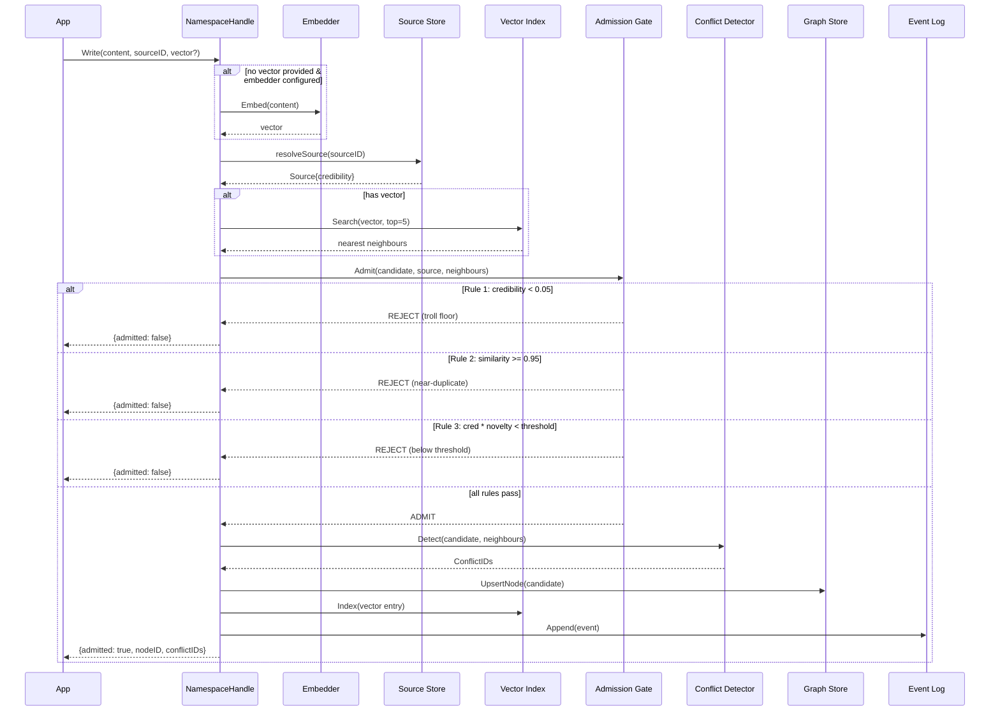
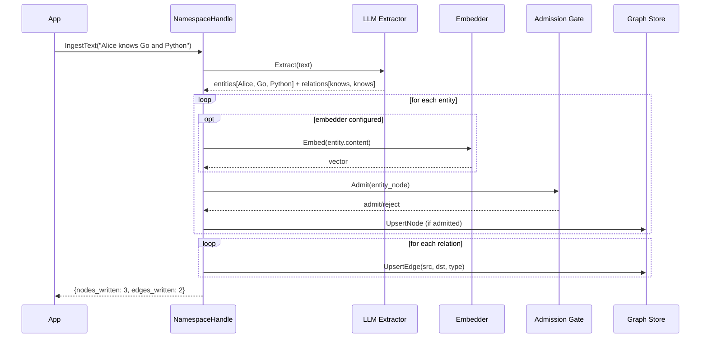

# Write Path

Every write passes through auto-embedding, the admission gate, and conflict detection before being persisted.

## Sequence



## Step by step

### 1. Auto-embedding

If the write does not include a pre-computed vector and an `Embedder` is configured, the `Content` text is automatically embedded. The embedding is cached (LRU with SHA256 keys) to avoid redundant API calls. See [Auto-Embedding](embedding) for details.

### 2. Source resolution

Look up the source by `ExternalID`. If it doesn't exist, create one with neutral credibility (0.5). Apply label overrides ("moderator" -> 1.0, "troll" -> 0.05).

### 3. Near-duplicate scan

If the write includes a vector, do a quick ANN search for the 5 nearest existing nodes. This is used by the admission gate to detect duplicates and compute novelty.

### 4. Admission gate

Three rules run in order:

| Rule | Condition | Result |
|:-----|:----------|:-------|
| Credibility floor | `effective_credibility <= 0.05` | Reject |
| Near-duplicate | `max(similarity) >= 0.95` | Reject |
| Novelty threshold | `credibility * (1 - max_similarity) < threshold` | Reject |

### 5. Conflict detection

After admission, the conflict detector examines the nearest neighbours for contradictions. Candidates with moderate similarity (0.3–0.95) and shared labels are assessed. If an LLM provider is configured, it evaluates contradiction probability; otherwise, a heuristic is used. Confirmed contradictions create `contradicts` edges in the graph. See [Conflict Detection](../concepts/conflict-detection) for details.

### 6. Persist

If admitted:
- **Graph store**: `UpsertNode` writes the node with full metadata
- **Vector index**: `Index` adds the embedding for future ANN search
- **Event log**: `Append` records the write event
- **Metrics**: counters for admitted/rejected, latency histograms

### 7. Confidence assignment

The node's final confidence is:

```
node.confidence = initial_confidence * source_credibility
```

If no explicit confidence was provided, it defaults to the source's effective credibility.

### 8. Credibility feedback

The [credibility learning](../concepts/conflict-detection#credibility-feedback-loop) background worker periodically reviews contradiction edges and adjusts source credibility via Bayesian updates. Sources that consistently produce validated information gain trust; sources that are frequently contradicted lose it.

## IngestText pipeline

`IngestText` adds LLM extraction before the standard write path:


