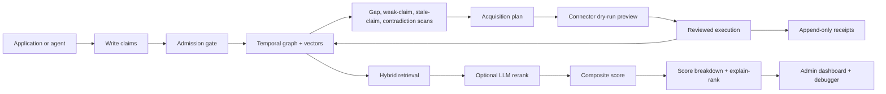

# AI Verification and Ranking

contextdb treats verification, acquisition, retrieval, and ranking as one audit loop. Claims enter with source and confidence metadata, weak areas become acquisition tasks, connector runs are dry-run-first, and every retrieval can be explained through score components, evidence, and source history.

## End-to-end flow



## Verification signals

The system does not store a claim as just text plus an embedding. Each node can carry:

| Signal | Purpose |
|:-------|:--------|
| `source_id` | Connects a claim to source credibility and source trust history |
| `confidence` | Claim-level belief before scoring and feedback updates |
| labels | Keeps claims, evidence, procedures, acquired items, and review categories queryable |
| validity windows | Separates when something was true from when contextdb learned it |
| graph edges | Tracks support, provenance, derivation, and contradictions |
| feedback | Validates, refutes, marks useful, or marks stale without erasing audit history |

Contradictory or weak claims become inspectable evidence rather than silent overwrites. Source credibility updates in Beta space as claims are validated or refuted, and retrieval can weight confidence more heavily in belief-system namespaces.

## Acquisition planning

Use the planner when you want the database to tell you what needs more evidence:

```bash
curl -X POST http://localhost:7701/v1/namespaces/my-app/acquisition/plan \
  -H "Content-Type: application/json" \
  -d '{"budget": 5, "max_gaps": 3}'
```

Plans can include research, crawl, verification, refresh, low-confidence, stale-claim, and contradiction follow-up tasks. The response includes priority, related node IDs, descriptions, and prompts that can be handed to a connector or reviewed by an operator.

## Connector dry-runs

Execution is dry-run by default. A dry-run returns the connector calls that would happen, including payload hashes and source constraints, without contacting the connector or writing nodes:

```bash
curl -X POST http://localhost:7701/v1/namespaces/my-app/acquisition/execute \
  -H "Content-Type: application/json" \
  -d '{
    "budget": 2,
    "max_results": 3,
    "allowed_source_ids": ["docs/runbook"],
    "connectors": [
      {
        "id": "docs-search",
        "type": "search",
        "endpoint": "https://search.example.internal/contextdb",
        "allowed_source_ids": ["docs/runbook"],
        "default_labels": ["acquired", "connector:search"]
      }
    ]
  }'
```

Add `"execute": true` only after reviewing the plan. Connector responses may return an array of items or `{ "items": [...] }`. Each item can include `title`, `url`, `snippet`, `content`, `source_id`, `labels`, `confidence`, and `metadata`. Results outside the request or connector source allow-list are ignored before writes.

## Provider adapters

contextdb ships a separate connector adapter server for provider-backed search workflows:

```bash
OPENAI_API_KEY=... \
XAI_API_KEY=... \
ANTHROPIC_API_KEY=... \
contextdb connectors serve \
  --addr :7780 \
  --providers openai,xai,anthropic \
  --allowed-domains docs.example.com,github.com
```

Then point acquisition execution at one of the local adapter endpoints:

| Endpoint | Provider | Use |
|:---------|:---------|:----|
| `POST /openai/search` | OpenAI | Responses API with web-search tooling |
| `POST /xai/search` | xAI | Responses-compatible web-search workflow |
| `POST /anthropic/search` | Anthropic | Messages API with web search |

```json
{
  "budget": 2,
  "max_results": 3,
  "allowed_source_ids": ["openai:web"],
  "connectors": [
    {
      "id": "openai-web",
      "type": "search",
      "endpoint": "http://localhost:7780/openai/search",
      "allowed_source_ids": ["openai:web"],
      "default_labels": ["acquired", "provider:openai"]
    }
  ]
}
```

Provider defaults can be overridden with `CONTEXTDB_OPENAI_CONNECTOR_MODEL`, `CONTEXTDB_XAI_CONNECTOR_MODEL`, `CONTEXTDB_ANTHROPIC_CONNECTOR_MODEL`, `CONTEXTDB_OPENAI_BASE_URL`, `CONTEXTDB_XAI_BASE_URL`, and `CONTEXTDB_ANTHROPIC_BASE_URL`.

## Retries and receipts

Executed connector attempts write append-only receipts. Receipts include payload and response hashes, status code, retryability, written node IDs, and the stable `X-ContextDB-Acquisition-Idempotency-Key` sent to the connector.

Set `max_attempts` above `1` to retry transient connector failures such as `408`, `429`, `502`, `503`, or `504`:

```json
{
  "budget": 2,
  "max_results": 3,
  "max_attempts": 3,
  "execute": true,
  "connectors": []
}
```

Inspect receipts and retry guidance without sending new connector calls:

```bash
curl "http://localhost:7701/v1/namespaces/my-app/acquisition/receipts"
curl "http://localhost:7701/v1/namespaces/my-app/acquisition/retry-candidates"
curl "http://localhost:7701/v1/namespaces/my-app/acquisition/retry-recommendations"
```

Retry recommendations use capped exponential backoff and include `recommended_after`, `delay_seconds`, `ready`, and `reason`.

## Retrieval and reranking

Retrieval fans out across vector search, graph traversal, and session context, then fuses candidates. If an LLM reranker is configured and the query includes text, contextdb runs a cross-encoder-style rerank before final scoring. If the reranker fails or is not configured, candidates continue through the normal scoring path.

The final score remains explainable:

```text
score = w_sim * similarity + w_conf * confidence + w_rec * recency + w_util * utility
```

Use query-time weights or namespace mode defaults to tune the tradeoff. For example, `belief_system` boosts confidence, while `agent_memory` gives more weight to utility and recency.

## Ranking evaluation CLI

Run the representative corpus evaluation before and after ranking changes:

```bash
contextdb eval ranking --out ranking-eval.json --report
contextdb eval ranking --markdown-out ranking-eval.md
contextdb eval ranking --compare previous-ranking-eval.json --diff-markdown
```

For release-friendly baselines:

```bash
contextdb eval ranking --baseline-dir .contextdb/ranking-baselines
contextdb eval ranking \
  --compare-baseline-dir .contextdb/ranking-baselines \
  --diff-markdown
```

To keep retained baseline artifacts auditable:

```bash
contextdb eval ranking \
  --baseline-retention-dir .contextdb/ranking-baselines \
  --baseline-retention-keep 5 \
  --baseline-manifest-out ranking-baseline-manifest.json

contextdb eval ranking baseline manifest verify \
  --manifest ranking-baseline-manifest.json \
  --bundle-dir ranking-baseline-verification
```

## Explain and debug

Use explain-rank when two results need a direct comparison:

```bash
curl -X POST http://localhost:7701/v1/namespaces/my-app/rank/explain \
  -H "Content-Type: application/json" \
  -d '{
    "node_id": "NODE_UUID",
    "other_node_id": "OTHER_NODE_UUID",
    "text": "optional query context",
    "max_depth": 2
  }'
```

The admin UI on the observe port gives the same workflow in the browser:

```bash
open http://localhost:7702/admin/
```

The dashboard includes ranking evaluation, metrics, baseline deltas, query evidence, score component bars, debugger search, belief audits, source-trust timelines, contradiction paths, graph/source context, and explain-rank comparison.

## Related docs

- [Read Path](/architecture/read-path)
- [Scoring Function](/concepts/scoring)
- [Epistemics Layer](/concepts/epistemics)
- [REST API](/api/rest)
- [Benchmarks](/benchmarks)
- [Ranking Baseline Retention](/deployment/ranking-baseline-retention-cookbook)
