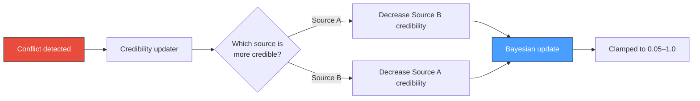

# Conflict Detection

When new information contradicts existing knowledge, contextdb detects the conflict at write time and records it as a graph edge. This enables downstream retrieval to surface contradictions and lets credibility learning adjust source trust.

## How it works

The conflict detector runs as part of the write path, after the admission gate accepts a candidate node.

```mermaid
flowchart TD
    A[New node admitted] --> B[Near-duplicate scan]
    B --> C{Candidates found?}
    C -->|No| D[Store node]
    C -->|Yes| E[Filter candidates]
    E --> F{Similarity 0.3–0.95?<br/>Shared labels?}
    F -->|No| D
    F -->|Yes| G[Assess contradiction]
    G --> H{P(contradiction) > 0.5?}
    H -->|No| D
    H -->|Yes| I[Create contradicts edge]
    I --> J[Return ConflictIDs]
    J --> D

    style A fill:#4a9eff,stroke:#333,color:#fff
    style I fill:#e74c3c,stroke:#333,color:#fff
    style D fill:#2ecc71,stroke:#333,color:#fff
```

## Candidate filtering

Not every similar node is a potential contradiction. The detector applies these filters:

| Criterion | Range | Rationale |
|:----------|:------|:----------|
| Cosine similarity | 0.30 – 0.95 | Too low = unrelated; too high = near-duplicate (caught by admission gate) |
| Label overlap | At least one shared label | Nodes about different topics rarely contradict |
| Different source | Preferred, not required | Same-source contradictions are still valid |

## Contradiction assessment

For each candidate that passes filtering, the detector estimates `P(contradiction)`:

**With LLM provider:** The candidate and existing node are sent to the LLM with a prompt asking whether they contradict. The response is parsed as a probability.

**Without LLM (heuristic fallback):** A simple heuristic based on similarity and confidence:

```
P(contradiction) = (1 - similarity) * min(candidate.confidence, existing.confidence)
```

Nodes with moderate similarity (saying similar things differently) and high confidence on both sides are more likely to be genuine contradictions.

## Contradicts edges

When a contradiction is confirmed (`P > 0.5`), the detector creates a directed edge:

```
new_node --[contradicts]--> existing_node
```

The edge carries:
- `Confidence`: the probability estimate from assessment
- `ValidFrom`: the time of detection
- Provenance linking back to both sources

These edges are visible via graph walk and can be used by retrieval strategies to downweight contested claims.

## Write result

The `WriteResult` includes `ConflictIDs`, a list of node IDs that the new write contradicts. Callers can use this to:

- Surface conflicts to end users
- Trigger review workflows
- Adjust their own confidence in the new information

## Credibility feedback loop

Contradictions feed into [credibility learning](credibility). When a new node from a trusted source contradicts an existing node from a less trusted source, the less trusted source's credibility decreases. Over time, sources that consistently produce contradicted information are penalised.



## Configuration

Conflict detection is automatic when a vector is provided with the write. No additional configuration is required. The LLM provider (if configured via `Options.LLMProvider`) enables higher-quality contradiction assessment.
