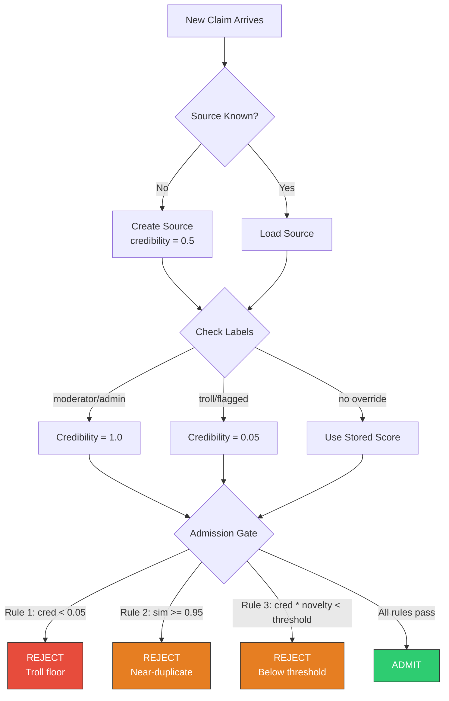

# Source Credibility

contextdb tracks the trustworthiness of information sources and uses it to gate admission and weight retrieval.

## How it works



## Sources

Every piece of data has a source. Sources are automatically created on first write:

```go
// First write from "user:bob" creates a source with credibility 0.5
ns.Write(ctx, client.WriteRequest{
    Content:  "Go is fast",
    SourceID: "user:bob",
    Vector:   embedding,
})
```

Source fields:

| Field | Description |
|:------|:------------|
| `ExternalID` | Your identifier (Discord ID, agent name, URL) |
| `CredibilityScore` | Base credibility [0, 1], starts at 0.5 |
| `Labels` | Override labels: "moderator", "admin", "troll", "flagged" |
| `ClaimsAsserted` | Total claims from this source |
| `ClaimsValidated` | Claims later confirmed |
| `ClaimsRefuted` | Claims later contradicted |

## Label overrides

Labels override the numeric score entirely:

```go
// Full trust -- credibility always 1.0
ns.LabelSource(ctx, "moderator:alice", []string{"moderator"})

// Blocked -- credibility always 0.05, all writes rejected
ns.LabelSource(ctx, "user:spammer", []string{"troll"})
```

| Label | Effective Credibility |
|:------|:---------------------|
| `moderator` | 1.0 |
| `admin` | 1.0 |
| `flagged` | 0.05 |
| `troll` | 0.05 |

## The admission gate

Three rules run in order on every write:

### Rule 1: Credibility floor
Sources with effective credibility <= 0.05 are always rejected. This stops troll floods at the gate.

### Rule 2: Near-duplicate detection
If an existing node has cosine similarity >= 0.95 to the candidate, the write is rejected as a duplicate.

### Rule 3: Novelty threshold
The combined score `credibility * novelty` must exceed the namespace's admission threshold:

| Namespace | Threshold | Effect |
|:----------|:----------|:-------|
| belief_system | 0.15 | Low bar -- credibility gates retrieval instead |
| general | 0.25 | Balanced |
| agent_memory | 0.35 | Stricter -- avoid low-value episodes |
| procedural | 0.40 | Only well-established procedures admitted |

## Confidence propagation

When a write is admitted, the node's confidence is:

```
node.confidence = source_credibility * confidence_multiplier
```

This means a moderator's claims (credibility 1.0) carry full confidence, while unknown sources (credibility 0.5) are automatically discounted.
