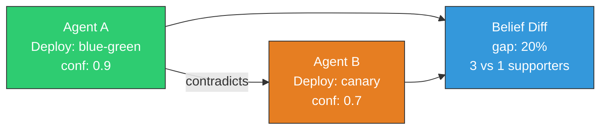
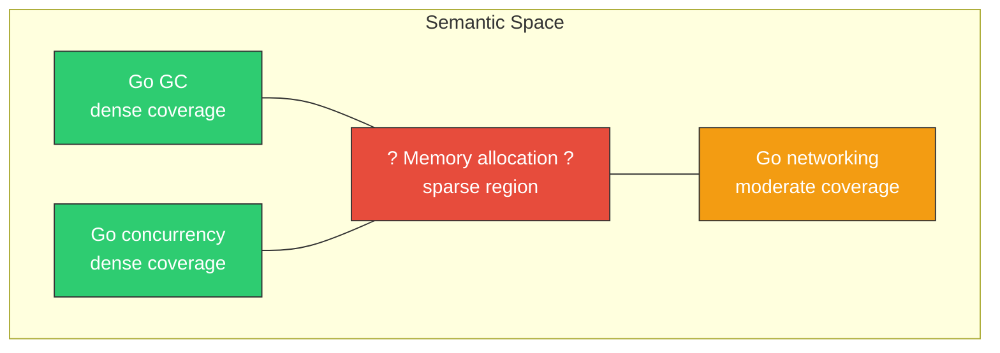

# Epistemics Layer

contextdb goes beyond storage to become the **epistemics layer** for AI systems — the component that makes AI memory auditable, trustworthy, and self-aware.

{: .note }
> **Epistemics** is the branch of philosophy concerned with the nature and scope of knowledge. An epistemics layer doesn't just store facts — it tracks *why* the system believes them, *how confident* it should be, and *what it doesn't know*.

## Belief reconciliation

When multiple agents write to the same namespace, disagreements are inevitable. contextdb exposes these as structured **belief diffs** — not just merged results.

This is "git diff for beliefs" — the resolution strategy (credibility-weighted, recency-weighted, human-in-the-loop) becomes a policy decision, not a merge algorithm.

## Narrative retrieval

Instead of returning a ranked list of chunks, contextdb can explain *why* it believes something:

> "**High confidence claim** from a highly credible source (92%), supported by 3 pieces of evidence, with 1 active contradiction. Confidence 90% based on: source credibility 92%; 3 supporting claims; 1 contradicting claim reducing confidence. Confidence has increased over time."

Every statement is backed by a citation with node ID, source ID, confidence, and provenance depth.

## Knowledge gap detection

Every retrieval system is good at finding what it knows. contextdb also knows what it *doesn't* know:

Gap detection probes the vector space between known nodes to find sparse regions, then suggests what information to acquire.

## Calibration

Confidence scores are only meaningful if they're *calibrated* — a claim with 0.7 confidence should be true about 70% of the time.

contextdb measures calibration quality via **Brier score** and **Expected Calibration Error**, then corrects it with **Platt scaling** (logistic regression on predicted vs actual outcomes).

{: .tip }
> Calibration requires at least 50 resolved truth estimates before activation. Until then, raw confidence is used as-is.

## Interference detection

New information shouldn't blindly overwrite established knowledge. When a low-credibility source contradicts a well-established claim backed by multiple supporters, contextdb flags it as **interference**:

- The contradiction is still recorded (the disagreement is tracked)
- But the original claim's confidence is **not reduced**
- The new claim must earn credibility through independent validation

## GDPR erasure

Right-to-erasure isn't deletion — it's **auditable retraction**:

1. All nodes from the subject are retracted (ValidUntil set, not deleted)
2. Vector embeddings are fully removed
3. Edges are invalidated
4. The audit trail records *that* erasure happened, without retaining *what* was erased

## Active learning

The system recommends what to learn next by combining:

- **Knowledge gaps** — sparse semantic regions
- **Low-confidence claims** — uncertain knowledge needing evidence
- **Expiring claims** — stale information needing refresh
- **Contradicted claims** — old disputes needing resolution
