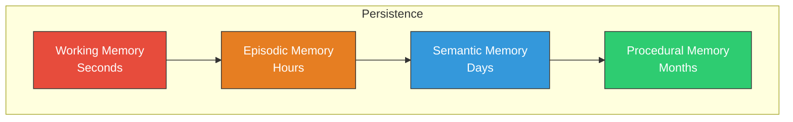

# Memory Types

contextdb models cognitive memory types with different decay rates. This is primarily useful in `agent_memory` namespaces where different kinds of knowledge should fade at different speeds.

## The four types



| Type | Constant | Alpha | Half-life | What it models |
|:-----|:---------|:------|:----------|:---------------|
| **Working** | `core.MemoryWorking` | 999.0 | ~seconds | Current task context, scratch state |
| **Episodic** | `core.MemoryEpisodic` | 0.08 | ~8.7 hours | Specific events and interactions |
| **Semantic** | `core.MemorySemantic` | 0.02 | ~34.7 hours | Generalized facts and knowledge |
| **Procedural** | `core.MemoryProcedural` | 0.001 | ~29 days | Learned skills and workflows |
| **General** | `core.MemoryGeneral` | 0.05 | ~13.9 hours | Untyped (default) |

## Using memory types

Set `MemType` on writes to control how fast a memory decays:

```go
// This interaction happened just now -- will fade in hours
ns.Write(ctx, client.WriteRequest{
    Content: "User asked about deployment",
    SourceID: "agent:self",
    Vector:   embedding,
    MemType:  core.MemoryEpisodic,
})

// This is a learned fact -- will persist for days
ns.Write(ctx, client.WriteRequest{
    Content: "The production database is on us-east-1",
    SourceID: "agent:self",
    Vector:   embedding,
    MemType:  core.MemorySemantic,
})

// This is a learned procedure -- will persist for weeks
ns.Write(ctx, client.WriteRequest{
    Content: "To deploy: build, push image, helm upgrade",
    SourceID: "agent:self",
    Vector:   embedding,
    MemType:  core.MemoryProcedural,
})
```

## Decay mechanics

The decay function is:

```
recency_score = exp(-alpha * age_in_hours)
```

After one half-life, the recency score drops to 0.5. After two half-lives, it's 0.25. The memory doesn't disappear -- it just ranks lower in retrieval results.

| Hours elapsed | Working | Episodic | Semantic | Procedural |
|:-------------|:--------|:---------|:---------|:-----------|
| 1 | ~0.00 | 0.92 | 0.98 | 1.00 |
| 8 | ~0.00 | 0.53 | 0.85 | 0.99 |
| 24 | ~0.00 | 0.15 | 0.62 | 0.98 |
| 168 (1 week) | ~0.00 | ~0.00 | 0.03 | 0.85 |
| 720 (1 month) | ~0.00 | ~0.00 | ~0.00 | 0.49 |

## When to use which type

**Working memory**: For ephemeral context that's only relevant during the current task. Think "the user just said X" or "I'm currently working on Y". Drops off almost immediately.

**Episodic memory**: For specific interactions and events. "The deploy failed at 3pm" or "User asked to increase the timeout". Important for a few hours, then fades.

**Semantic memory**: For generalised facts extracted from episodes. "The API uses JWT auth" or "Deploys take about 5 minutes". Persists across sessions.

**Procedural memory**: For learned skills and workflows. "To fix a broken deploy: check logs, rollback, redeploy". These should persist for weeks or months.
