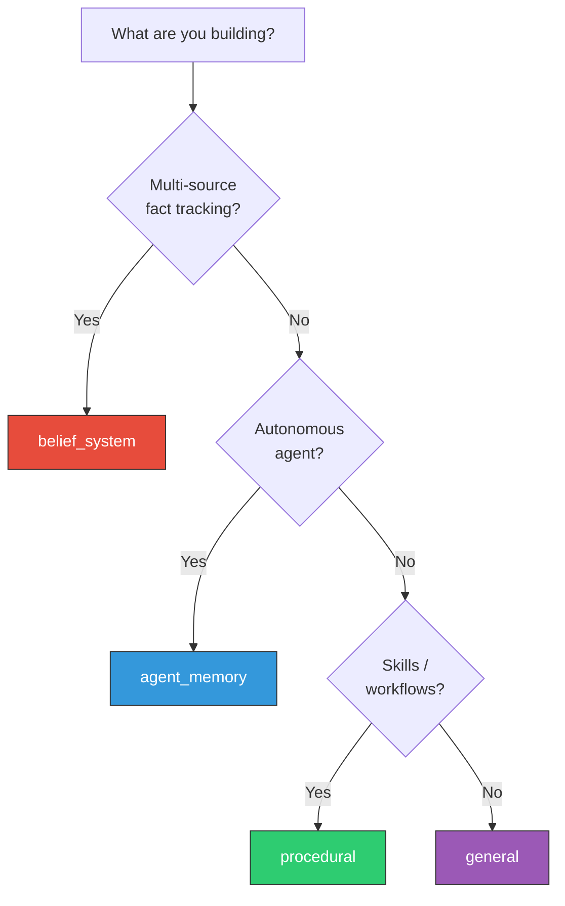

# Namespace Modes

Namespaces isolate data and define default retrieval behaviour. Each namespace has a **mode** that tunes scoring weights, admission thresholds, traversal strategy, and compaction.

## Choosing a mode



## Mode comparison

| | belief_system | agent_memory | general | procedural |
|:--|:------------|:-------------|:--------|:-----------|
| **Primary weight** | Confidence (0.45) | Similarity (0.35) | Similarity (0.40) | Confidence + Similarity (0.40 each) |
| **Decay** | Slow (alpha=0.03) | Medium (0.05) | Medium (0.05) | Very slow (0.001) |
| **Admission** | Low bar (0.15) | Strict (0.35) | Balanced (0.25) | Strict (0.40) |
| **Traversal** | WaterCircle | Beam | WaterCircle | BFS |
| **Max depth** | 4 | 2 | 3 | 3 |
| **Compaction** | Off | RAPTOR | Off | Off |
| **Best for** | Chatbots, fact DBs | Agentic workflows | RAG, search | Skill storage |

## Usage

```go
// Create or get a namespace with the desired mode
ns := db.Namespace("channel:general", namespace.ModeBeliefSystem)

// The mode sets defaults. You can override per-query
results, _ := ns.Retrieve(ctx, client.RetrieveRequest{
    Vector: queryVec,
    TopK:   10,
    // ScoreParams override is optional
})
```

## belief_system

Designed for multi-source fact tracking where trust matters more than freshness.

- Source credibility is weighted highest (0.45)
- Troll and spam sources are rejected at the gate
- Wide graph traversal (depth 4) finds corroborating evidence
- Low admission threshold (0.15). Credibility gates retrieval, not ingestion

**Use cases**: Discord channel bots, knowledge bases with community input, fact-checking systems.

## agent_memory

Designed for autonomous agents that learn from task outcomes.

- Utility feedback and recency are weighted heavily
- RAPTOR compaction automatically summarises similar memories
- Beam traversal for focused exploration
- Strict admission (0.35) avoids storing low-value episodes
- Memory types control decay: episodic fades fast, semantic persists longer

**Use cases**: LLM agents, task planners, conversational agents with long-term memory.

## general

Balanced defaults suitable for most retrieval workloads.

- Similarity-first (0.40) for traditional vector search behaviour
- Moderate confidence and recency weighting
- Good starting point when you're not sure which mode to use

**Use cases**: RAG pipelines, document search, general-purpose retrieval.

## procedural

Optimised for learned procedures and workflows that should persist.

- Very slow decay (alpha=0.001, half-life ~29 days)
- High confidence weight rewards validated procedures
- Strict admission (0.40) ensures only quality procedures are stored
- BFS traversal follows dependency chains

**Use cases**: Skill libraries, runbook storage, workflow automation.
