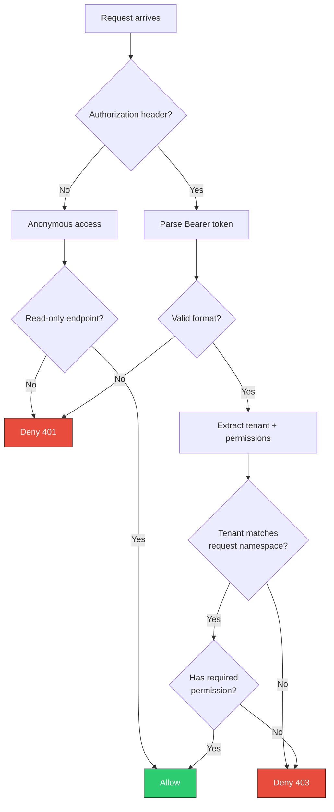

# Role-Based Access Control

contextdb supports token-based RBAC for multi-tenant deployments. Tokens encode the tenant identity and permissions, and middleware enforces access on every request.

## Token format

Tokens follow a simple colon-delimited format:

```
tenant:permissions:secret
```

| Segment | Description | Example |
|:--------|:------------|:--------|
| `tenant` | Tenant identifier | `acme-corp` |
| `permissions` | Comma-separated permission list | `read,write` |
| `secret` | Authentication secret | `sk-abc123` |

Example tokens:

```
acme-corp:read:sk-viewer-token
acme-corp:read,write:sk-editor-token
acme-corp:admin:sk-admin-token
```

## Permissions

| Permission | Allows |
|:-----------|:-------|
| `read` | Retrieve, GetNode, Walk, History, NodeHistory, Edges |
| `write` | Write, WriteBatch, IngestText, LabelSource, AddEdge |
| `admin` | All operations including source management, snapshots, KV, events |

The `admin` permission implies both `read` and `write`.

## Middleware flow



## HTTP usage

Pass the token as a Bearer token in the `Authorization` header:

```bash
curl -X POST http://localhost:7701/v1/namespaces/my-app/write \
  -H "Authorization: Bearer acme-corp:write:sk-secret" \
  -H "Content-Type: application/json" \
  -d '{"content": "...", "source_id": "..."}'
```

The tenant ID from the token is prepended to the namespace: `acme-corp/my-app`.

## gRPC usage

Set the `authorization` metadata key:

```go
import "google.golang.org/grpc/metadata"

md := metadata.Pairs("authorization", "Bearer acme-corp:write:sk-secret")
ctx := metadata.NewOutgoingContext(ctx, md)
```

## Backward compatibility

Anonymous requests (no `Authorization` header) are permitted for read operations. This preserves backward compatibility with existing deployments. Write and admin operations always require a valid token when RBAC middleware is active.

## Tenant isolation

Each tenant's data is isolated by prepending the tenant ID to the namespace. A token for `acme-corp` cannot access data in the `other-corp` tenant, even if the namespace names match.

| Token tenant | Request namespace | Effective namespace | Result |
|:-------------|:------------------|:--------------------|:-------|
| `acme-corp` | `my-app` | `acme-corp/my-app` | Allowed |
| `acme-corp` | `my-app` | `other-corp/my-app` | Denied |
| (anonymous) | `my-app` | `my-app` | Allowed (read only) |
