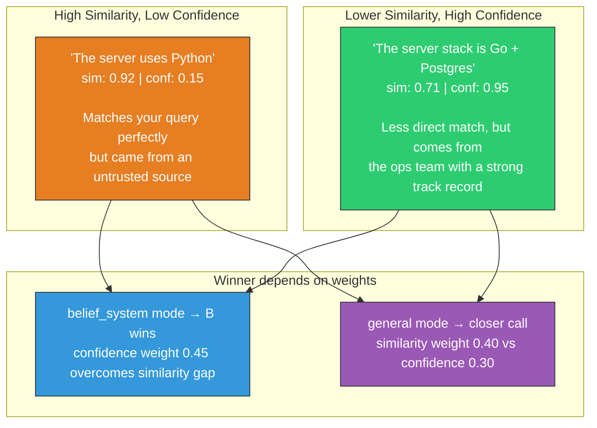
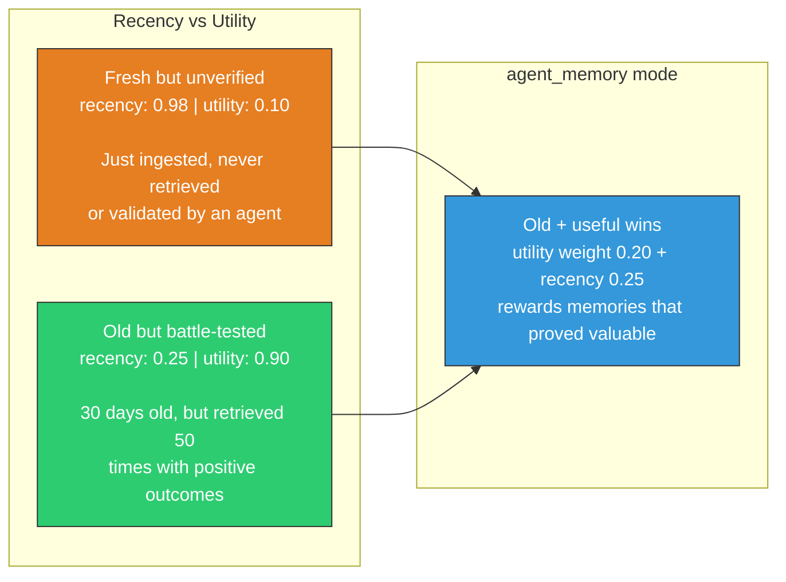
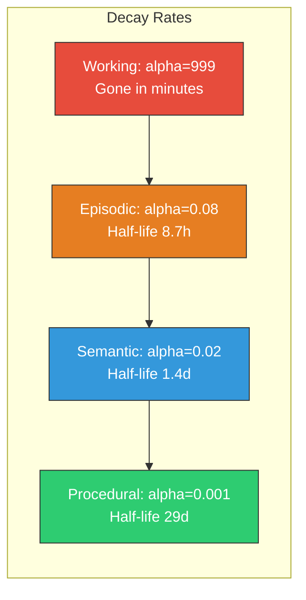

# Scoring Function

Every retrieval result in contextdb is ranked by a composite score combining four dimensions.

## The formula

```
score(candidate) =
    w_sim  * cosine_similarity(candidate.vector, query.vector)
  + w_conf * candidate.confidence
  + w_rec  * exp(-alpha * age_hours)
  + w_util * utility_feedback_score
```

All weights are normalised to sum to 1.0 at query time. You control `alpha` (decay rate) and the four weights.

## Score dimensions

| Dimension | Range | What it measures |
|:----------|:------|:-----------------|
| **Similarity** | [0, 1] | Vector cosine similarity to the query |
| **Confidence** | [0, 1] | How trustworthy the fact is (from source credibility) |
| **Recency** | [0, 1] | Exponential decay from `valid_from` to now |
| **Utility** | [0, 1] | Past usefulness feedback (agent memory mode) |

### How the dimensions interact

Each dimension captures something the others miss. Here's how they play out in practice:





These trade-offs are why contextdb lets you tune per query. A chatbot answering "what language does the server use?" needs high similarity weight. A security audit checking "is this claim trustworthy?" needs high confidence weight. An agent deciding "what's still relevant?" needs recency and utility.

## Recency decay

Recency uses exponential decay:

```
recency = exp(-alpha * age_in_hours)
```



| Memory type | Alpha | Half-life |
|:------------|:------|:----------|
| Working | 999.0 | ~seconds |
| Episodic | 0.08 | ~8.7 hours |
| Semantic | 0.02 | ~34.7 hours |
| Procedural | 0.001 | ~29 days |
| General (default) | 0.05 | ~13.9 hours |

## Preset strategies

Each namespace mode ships with tuned defaults:

| Mode | Similarity | Confidence | Recency | Utility | Alpha |
|:-----|:-----------|:-----------|:--------|:--------|:------|
| **belief_system** | 0.30 | 0.45 | 0.20 | 0.05 | 0.03 |
| **agent_memory** | 0.35 | 0.20 | 0.25 | 0.20 | 0.05 |
| **general** | 0.40 | 0.30 | 0.20 | 0.10 | 0.05 |
| **procedural** | 0.40 | 0.40 | 0.15 | 0.05 | 0.001 |

## Overriding at query time

Pass `ScoreParams` to override any namespace defaults:

```go
results, _ := ns.Retrieve(ctx, client.RetrieveRequest{
    Vector: queryVec,
    TopK:   10,
    ScoreParams: core.ScoreParams{
        SimilarityWeight: 0.60,
        ConfidenceWeight: 0.20,
        RecencyWeight:    0.15,
        UtilityWeight:    0.05,
        DecayAlpha:       0.01, // slower decay
    },
})
```

## Score breakdown in results

Every `Result` exposes the individual component scores for debugging:

```go
for _, r := range results {
    fmt.Printf("composite=%.3f sim=%.3f conf=%.3f rec=%.3f util=%.3f source=%s\n",
        r.Score,
        r.SimilarityScore,
        r.ConfidenceScore,
        r.RecencyScore,
        r.UtilityScore,
        r.RetrievalSource,
    )
}
```

## Provenance attenuation

Claims derived through a chain of sources lose confidence at each hop. If "Alice told Bob who told the system," each hop attenuates by a configurable factor (default 0.9):

```
confidence_effective = confidence * 0.9^provenance_depth
```

A direct claim (depth 0) keeps full confidence. A claim derived through 3 hops retains ~73% of its original confidence.

## Expiry-aware scoring

Nodes with a `ValidUntil` deadline get a confidence penalty as expiry approaches. This prevents soon-to-expire facts from ranking alongside evergreen knowledge:

```
penalty = 1 - exp(-0.02 * hours_until_expiry)
```

48 hours before expiry, confidence is reduced by ~60%. This is applied automatically — no configuration needed.

{: .note }
> **How this compares**: Most vector databases rank purely by embedding similarity. contextdb's four-dimensional scoring means a highly relevant but low-credibility result ranks below a moderately relevant but well-established one. This is the difference between "closest match" and "best answer."
