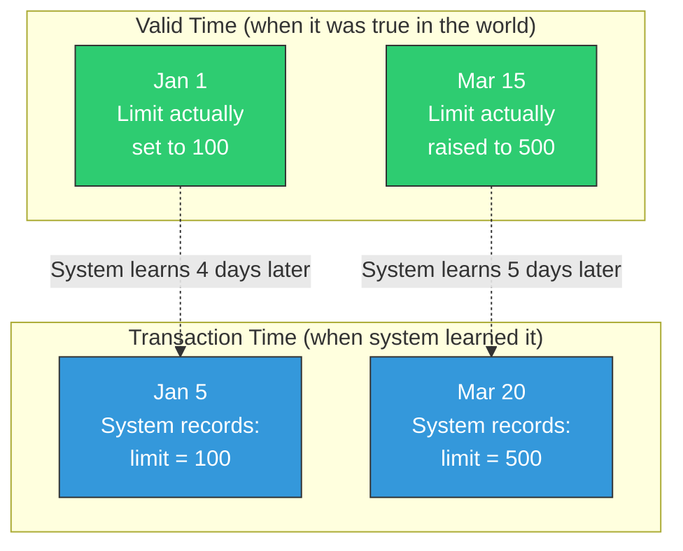

# Bi-Temporal Model

contextdb tracks two independent time dimensions for every node and edge.

## Two kinds of time



| Dimension | Field | Meaning |
|:----------|:------|:--------|
| **Valid time** | `ValidFrom` / `ValidUntil` | When the fact was true *in the world* |
| **Transaction time** | `TxTime` | When the system *learned* the fact |

These are independent. You can record a historical fact (valid_time in the past) that the system just learned (transaction_time = now).

## Why it matters

**Scenario**: Your crawler discovers on March 20th that the API rate limit was changed to 500 req/s on March 15th.

```go
ns.Write(ctx, client.WriteRequest{
    Content:    "API rate limit is 500 req/s",
    SourceID:   "config-crawler",
    Vector:     embed("API rate limit"),
    ValidFrom:  time.Date(2025, 3, 15, 0, 0, 0, 0, time.UTC),
    // TxTime is automatically set to now (March 20th)
})
```

Now queries understand that:
- Before March 15th: the limit was 100 req/s
- After March 15th: the limit is 500 req/s
- Before March 20th: the system didn't know about the change

::: info How this compares
Most vector databases have a single `created_at` timestamp or none at all. PostgreSQL supports bi-temporal queries but requires manual schema design and application-level enforcement. contextdb makes bi-temporal semantics automatic — every write gets both timestamps, every query respects them.
:::

## Temporal diff queries

Use the Diff API to see what changed between two points in time:

```go
// What changed in the last 24 hours?
diffs, _ := graph.Diff(ctx, "my-app", yesterday, now)
for _, d := range diffs {
    fmt.Printf("[%s] %s (v%d)\n", d.Change, core.NodeText(d.Node), d.Node.Version)
}
// [added] New team member joined (v1)
// [modified] Sprint deadline updated (v3)
// [removed] Old standup cancelled (v2)
```

## Time-travel queries

Use `ValidAt` to reconstruct the full state of the system as of any past moment:

```go
// What did the system believe on June 1st?
snapshot, _ := graph.ValidAt(ctx, "my-app", june1st, nil)
fmt.Printf("System held %d beliefs on June 1st\n", len(snapshot))
```

## Point-in-time queries

Use `AsOf` to pin retrieval to a historical timestamp:

```go
// What did we know as of January 10th?
results, _ := ns.Retrieve(ctx, client.RetrieveRequest{
    Vector: embed("API rate limit"),
    TopK:   1,
    AsOf:   time.Date(2025, 1, 10, 0, 0, 0, 0, time.UTC),
})
// Returns: "API rate limit is 100 req/s"
```

## Node validity

Nodes expose `IsValidAt(t)` for temporal filtering:

```go
node.ValidFrom   // when the fact became true
node.ValidUntil  // when the fact stopped being true (nil = still valid)
node.TxTime      // when the system recorded this

node.IsValidAt(time.Now()) // true if currently valid
```

## Version history

Track how a fact evolved over time:

```go
versions, _ := ns.History(ctx, nodeID)
for _, v := range versions {
    fmt.Printf("v%d  valid_from=%s  tx=%s  text=%s\n",
        v.Version, v.ValidFrom, v.TxTime, v.Properties["text"])
}
```

## Temporal edges

Edges also carry temporal fields:

```go
edge := core.Edge{
    Src:       nodeA,
    Dst:       nodeB,
    Type:      "supercedes",
    ValidFrom: time.Now(),
    // ValidUntil: nil means permanently valid
    // InvalidatedAt: for non-destructive logical deletion
}
```

Edges have `IsActiveAt(t)` which checks both validity window and logical deletion.
