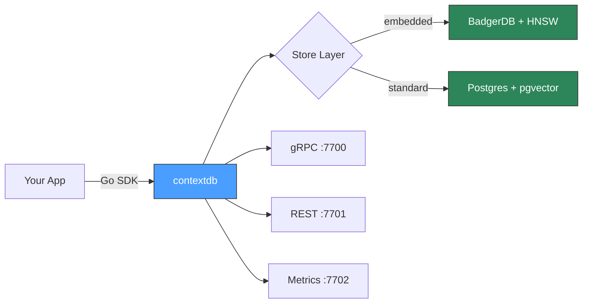

# contextdb

**A temporal graph-vector database for AI systems that need memory.**
{: .fs-6 .fw-300 }

contextdb stores claims, facts, memories, and beliefs as nodes in a graph. Every item carries an embedding vector, a temporal validity window, a confidence score, and a provenance chain. Retrieval scores across all four dimensions simultaneously -- the caller supplies the weights.

[Get started]{: .btn .btn-primary .fs-5 .mb-4 .mb-md-0 .mr-2 }
[View on GitHub](https://github.com/antiartificial/contextdb){: .btn .fs-5 .mb-4 .mb-md-0 }

[Get started]: 

---

## Why contextdb?

Most vector databases treat embeddings as the whole story. But AI systems that interact with the real world need more:

- **Facts expire.** A claim that was true yesterday may not be true today. contextdb tracks `valid_time` (when the fact was true in the world) and `transaction_time` (when the system learned it) independently. Point-in-time queries are first-class.

- **Sources lie.** Not all information sources are equally trustworthy. contextdb tracks source credibility and uses it as an admission gate -- troll-flood and poisoning attacks are stopped at write time, not post-hoc.

- **Memory decays.** Different kinds of knowledge decay at different rates. Episodic memories fade in hours; procedural skills persist for months. contextdb models this with configurable exponential decay.

- **Context matters.** A chatbot, an autonomous agent, and a RAG pipeline need different retrieval strategies. contextdb ships four namespace modes with tuned defaults -- switch between them with a single parameter.

## Five lines to a working database

```go
db := client.MustOpen(client.Options{})
defer db.Close()

ns := db.Namespace("my-app", namespace.ModeGeneral)

res, _ := ns.Write(ctx, client.WriteRequest{
    Content:  "Go 1.22 added routing patterns to net/http",
    SourceID: "docs-crawler",
    Vector:   embedding, // your embedding here
})

results, _ := ns.Retrieve(ctx, client.RetrieveRequest{
    Vector: queryEmbedding,
    TopK:   5,
})
```

Zero external dependencies. No Docker. No config files. One `go get` and you're running.

## The scoring function

Every retrieval result is scored by a weighted combination of four dimensions:

```
score = w_sim  * cosine_similarity(candidate, query)
      + w_conf * confidence
      + w_rec  * exp(-alpha * age_hours)
      + w_util * utility_feedback
```

All weights are normalised at query time. You supply `alpha` (decay rate) and the four weights -- or use namespace mode defaults.

## Architecture at a glance



## Deployment modes

| Mode | Backend | Use case |
|:-----|:--------|:---------|
| **Embedded** | In-memory or BadgerDB | Development, testing, sidecars, CLIs |
| **Standard** | Postgres + pgvector | Production single-node, teams |
| **Remote** | gRPC to contextdb server | Microservices, multi-language clients |

## Namespace modes

| Mode | Best for | Key weight |
|:-----|:---------|:-----------|
| `belief_system` | Fact tracking, poisoning resistance | confidence |
| `agent_memory` | Agentic workflows with task feedback | utility + recency |
| `general` | Balanced RAG, document retrieval | similarity |
| `procedural` | Skill and workflow storage | confidence, slow decay |

---

Built with Go. No CGO. Single binary. Scratch Docker image.
