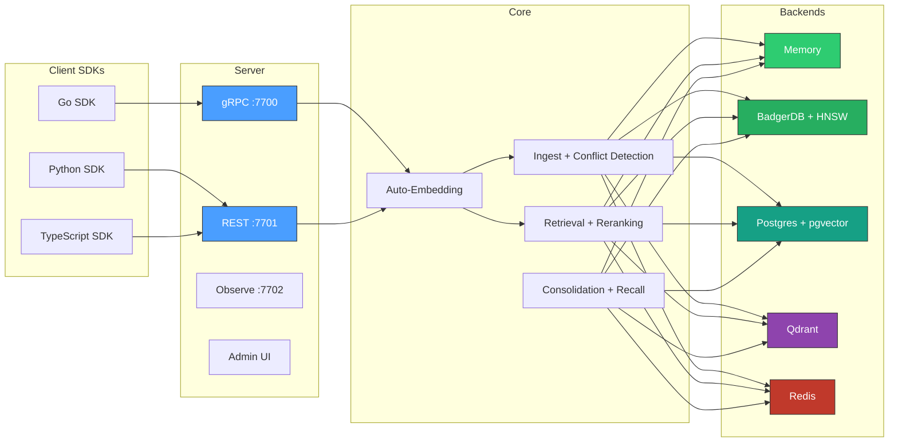

# contextdb

**The epistemics layer for AI systems — memory that knows what it knows, what it doesn't, and why it believes what it does.**
{: .fs-6 .fw-300 }

contextdb stores claims, facts, memories, and beliefs as nodes in a graph. Every item carries an embedding vector, a temporal validity window, a confidence score, and a provenance chain. Retrieval scores across all four dimensions simultaneously -- the caller supplies the weights.

[Get started]{: .btn .btn-primary .fs-5 .mb-4 .mb-md-0 .mr-2 }
[View on GitHub](https://github.com/antiartificial/contextdb){: .btn .fs-5 .mb-4 .mb-md-0 }

[Get started]: 

---

## Why contextdb?

Most vector databases treat embeddings as the whole story. But AI systems that interact with the real world need more:

- **Facts expire.** contextdb tracks `valid_time` (when the fact was true in the world) and `transaction_time` (when the system learned it) independently. Point-in-time queries are first-class.

- **Sources lie.** contextdb tracks source credibility and uses it as an admission gate. Credibility is learned over time via Bayesian updates -- sources that produce validated information gain trust; those that contradict reliable facts lose it.

- **Memory decays.** Different kinds of knowledge decay at different rates. Episodic memories fade in hours; procedural skills persist for months. Background workers consolidate episodic memories into durable semantic knowledge.

- **Context matters.** A chatbot, an autonomous agent, and a RAG pipeline need different retrieval strategies. contextdb ships four namespace modes with tuned defaults -- switch between them with a single parameter.

- **Contradictions happen.** contextdb detects conflicting claims at write time, tracks them as `contradicts` edges in the graph, and lets retrieval strategies account for them.

## Five lines to a working database

```go
db := client.MustOpen(client.Options{})
defer db.Close()

ns := db.Namespace("my-app", namespace.ModeGeneral)

res, _ := ns.Write(ctx, client.WriteRequest{
    Content:  "Go 1.22 added routing patterns to net/http",
    SourceID: "docs-crawler",  // tracks credibility of this source over time
    Vector:   embedding,       // or omit — auto-embedded when an Embedder is configured
})

results, _ := ns.Retrieve(ctx, client.RetrieveRequest{
    Vector: queryEmbedding,
    TopK:   5, // return the 5 highest-scoring results (default: 10)
    // TopK controls the result set size. Lower values (1–5) are faster and
    // more focused — good for single-answer lookups. Higher values (20–50)
    // give the retrieval pipeline more candidates to score, rerank, and
    // diversify — better for RAG contexts where you need broad coverage.
})
```

Zero external dependencies. No Docker. No config files. One `go get` and you're running. Auto-embedding lets you skip the vector -- just send text.

## Architecture at a glance



## The scoring function

Every retrieval result is scored by a weighted combination of four dimensions:

```
score = w_sim  * cosine_similarity(candidate, query)
      + w_conf * confidence
      + w_rec  * exp(-alpha * age_hours)
      + w_util * utility_feedback
```

All weights are normalised at query time. You supply `alpha` (decay rate) and the four weights -- or use namespace mode defaults.

## Deployment modes

| Mode | Backend | Use case |
|:-----|:--------|:---------|
| **Embedded** | In-memory or BadgerDB | Development, testing, sidecars, CLIs |
| **Standard** | Postgres + pgvector | Production single-node, teams |
| **Remote** | gRPC to contextdb server | Microservices, multi-language clients |
| **Scaled** | Qdrant + Redis + Postgres | High-throughput production |

## Namespace modes

| Mode | Best for | Key weight |
|:-----|:---------|:-----------|
| `belief_system` | Fact tracking, poisoning resistance | confidence |
| `agent_memory` | Agentic workflows with task feedback | utility + recency |
| `general` | Balanced RAG, document retrieval | similarity |
| `procedural` | Skill and workflow storage | confidence, slow decay |

## Key features

| Feature | Description |
|:--------|:------------|
| [Auto-embedding](architecture/embedding) | Text automatically embedded via OpenAI, local, or custom providers with LRU cache |
| [Conflict detection](concepts/conflict-detection) | Near-duplicate scan, contradiction tracking, `contradicts` edges |
| [Credibility learning](concepts/credibility) | Bayesian source trust updates based on validation/refutation |
| [Reranking](architecture/read-path) | Optional LLM cross-encoder reranking after fusion |
| [Label filtering](api/go-sdk) | Filter retrieval by node labels |
| [Background workers](architecture/background-workers) | Memory consolidation and active recall |
| [RBAC](concepts/rbac) | Token-based read/write/admin permissions per tenant |
| [Snapshot/restore](api/go-sdk#export--import) | NDJSON namespace export and import |
| [Python SDK](api/python-sdk) | REST client for Python applications |
| [TypeScript SDK](api/typescript-sdk) | REST client for TypeScript/Node.js applications |
| [Scaled deployment](deployment/scaled) | Qdrant + Redis + Postgres for high throughput |
| [Benchmarks](benchmarks) | MTEB, adversarial, LongMemEval, fitness suite |
| [Admin UI](deployment/scaled) | Built-in dashboard on observe port |

## Epistemics layer

Features that make AI memory auditable and trustworthy:

| Feature | Description |
|:--------|:------------|
| [Belief reconciliation](concepts/belief-reconciliation) | Structured disagreements between agents with evidence chains — "git diff for beliefs" |
| [Narrative retrieval](concepts/narrative-retrieval) | "Walk me through what you know about X and why" with full citations |
| [Knowledge gap detection](concepts/knowledge-gaps) | "What don't I know?" — sparse region detection with acquisition suggestions |
| [Calibration pipeline](concepts/calibration) | Brier score, ECE, Platt scaling — confidence becomes calibrated probability |
| [GDPR erasure](concepts/gdpr) | Audit-trailed right-to-erasure across graph, vectors, KV, and event log |
| [Interference detection](concepts/interference) | Low-credibility sources can't erode well-established claims |
| [Claim federation](concepts/federation) | Gossip-based multi-instance replication with Beta-space credibility merge |
| [Cascade retraction](concepts/retraction) | Non-destructive "I take this back" that cascades through derived claims |
| [Active learning](concepts/active-learning) | System recommends what information to acquire next |
| [Query DSL](api/dsl) | Pipe syntax and CQL with temporal, graph, and weight clauses |

---

Built with Go. No CGO. Single binary. Scratch Docker image.
