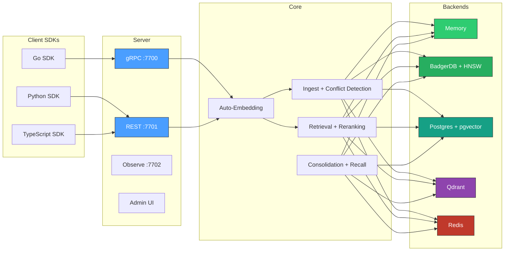

<div class="stat-row">
  <div class="stat-box">
    <span class="stat-value">4</span>
    <span class="stat-label">time dimensions</span>
  </div>
  <div class="stat-box">
    <span class="stat-value">4</span>
    <span class="stat-label">score components</span>
  </div>
  <div class="stat-box">
    <span class="stat-value">4</span>
    <span class="stat-label">namespace modes</span>
  </div>
  <div class="stat-box">
    <span class="stat-value">4</span>
    <span class="stat-label">deployment modes</span>
  </div>
</div>

---

## Five lines to a working database

Zero external dependencies. No Docker. No config files. One `go get` and you're running. Auto-embedding lets you skip the vector. Just send text.

::: code-group
```go [Go]
db := client.MustOpen(client.Options{})
defer db.Close()

ns := db.Namespace("my-app", namespace.ModeGeneral)
ns.Write(ctx, client.WriteRequest{
    Content:  "Go 1.22 added routing patterns to net/http",
    SourceID: "docs-crawler",
})
results, _ := ns.Retrieve(ctx, client.RetrieveRequest{
    Text: "What changed in Go 1.22?", TopK: 5,
})
```

```python [Python]
from contextdb import ContextDB

db = ContextDB("http://localhost:7701")
ns = db.namespace("my-app", mode="general")
ns.write(content="Go 1.22 added routing patterns", source_id="docs-crawler")
results = ns.retrieve(text="What changed in Go 1.22?", top_k=5)
```

```typescript [TypeScript]
import { ContextDB } from "contextdb";

const db = new ContextDB("http://localhost:7701");
const ns = db.namespace("my-app", "general");
await ns.write({ content: "Go 1.22 added routing patterns", sourceId: "docs-crawler" });
const results = await ns.retrieve({ text: "What changed in Go 1.22?", topK: 5 });
```

```bash [curl]
# Write
curl -X POST http://localhost:7701/v1/namespaces/my-app/write \
  -H "Content-Type: application/json" \
  -d '{"content": "Go 1.22 added routing patterns", "source_id": "docs-crawler"}'

# Retrieve
curl -X POST http://localhost:7701/v1/namespaces/my-app/retrieve \
  -H "Content-Type: application/json" \
  -d '{"text": "What changed in Go 1.22?", "top_k": 5}'
```
:::

## Architecture at a glance



## The scoring function

Every retrieval result is scored by a weighted combination of four dimensions:

```
score = w_sim  * cosine_similarity(candidate, query)
      + w_conf * confidence
      + w_rec  * exp(-alpha * age_hours)
      + w_util * utility_feedback
```

All weights are normalised at query time. You supply `alpha` (decay rate) and the four weights, or use namespace mode defaults.

## Deployment modes

| Mode | Backend | Use case |
|:-----|:--------|:---------|
| **Embedded** | In-memory or BadgerDB | Development, testing, sidecars, CLIs |
| **Standard** | Postgres + pgvector | Production single-node, teams |
| **Remote** | gRPC to contextdb server | Microservices, multi-language clients |
| **Scaled** | Qdrant + Redis + Postgres | High-throughput production |

## Namespace modes

| Mode | Best for | Key weight |
|:-----|:---------|:-----------|
| `belief_system` | Fact tracking, poisoning resistance | confidence |
| `agent_memory` | Agentic workflows with task feedback | utility + recency |
| `general` | Balanced RAG, document retrieval | similarity |
| `procedural` | Skill and workflow storage | confidence, slow decay |

## Key features

| Feature | Description |
|:--------|:------------|
| [Auto-embedding](architecture/embedding) | Text automatically embedded via OpenAI, local, or custom providers with LRU cache |
| [Conflict detection](concepts/conflict-detection) | Near-duplicate scan, contradiction tracking, `contradicts` edges |
| [Credibility learning](concepts/credibility) | Bayesian source trust updates based on validation/refutation |
| [Reranking](architecture/read-path) | Optional LLM cross-encoder reranking after fusion |
| [Label filtering](api/go-sdk) | Filter retrieval by node labels |
| [Background workers](architecture/background-workers) | Memory consolidation and active recall |
| [RBAC](concepts/rbac) | Token-based read/write/admin permissions per tenant |
| [Snapshot/restore](api/go-sdk#export--import) | NDJSON namespace export and import |
| [Python SDK](api/python-sdk) | REST client for Python applications |
| [TypeScript SDK](api/typescript-sdk) | REST client for TypeScript/Node.js applications |
| [Scaled deployment](deployment/scaled) | Qdrant + Redis + Postgres for high throughput |
| [Benchmarks](benchmarks) | MTEB, adversarial, LongMemEval, fitness suite |
| [Admin UI](deployment/scaled) | Built-in dashboard on observe port |

## Epistemics layer

Features that make AI memory auditable and trustworthy:

| Feature | Description |
|:--------|:------------|
| [Belief reconciliation](concepts/epistemics#belief-reconciliation) | Structured disagreements between agents with evidence chains |
| [Narrative retrieval](concepts/epistemics#narrative-retrieval) | "Walk me through what you know about X and why" with full citations |
| [Knowledge gap detection](concepts/epistemics#knowledge-gap-detection) | "What don't I know?" Sparse region detection with acquisition suggestions |
| [Calibration](concepts/epistemics#calibration) | Brier score, ECE, Platt scaling. Confidence becomes calibrated probability |
| [GDPR erasure](concepts/epistemics#gdpr-erasure) | Audit-trailed right-to-erasure across graph, vectors, KV, and event log |
| [Interference detection](concepts/epistemics#interference-detection) | Low-credibility sources can't erode well-established claims |
| [Claim federation](examples#federation-multi-instance-shared-memory) | Gossip-based multi-instance replication with Beta-space credibility merge |
| [Cascade retraction](examples#cascade-retraction-when-a-source-claim-is-wrong) | Non-destructive "I take this back" that cascades through derived claims |
| [Active learning](concepts/epistemics#active-learning) | System recommends what information to acquire next |
| [Query DSL](api/dsl) | Pipe syntax and CQL with temporal, graph, and weight clauses |

---

Built with Go. No CGO. Single binary. Scratch Docker image.
